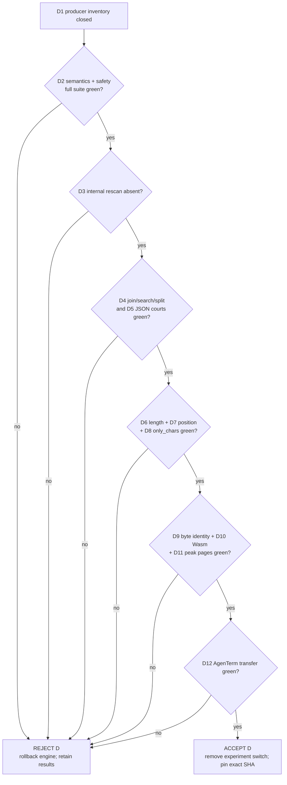

# Direct per-producer String metadata publication: decisive experiment

Status: **completed; Variant D rejected and engine rolled back**

Date: 2026-09-04  
Baseline: `a6ba2f9`; production engine source remains the compact four-byte
String record  
Purpose: decide whether every internal String producer can publish UTF-16
length and the all-ASCII fact without a general post-construction scan, while
retaining the successful static-`length` dispatcher and all existing workload
courts  
Implementation location if opened: `crates/tinyvm-qjs`; no public feature or
ABI  
Pre-reading: `plan/design-string-record-metadata-experiment.md` and
`plan/design-static-length-dispatch-experiment.md`

This is an upstream engine experiment. It does not change AgenTerm capability
status, version scope or tinyvm pin unless every gate selects the candidate.

## 0. Decision and settled facts

Should an opted-in module widen each String record by one word and require
each producer to publish that word directly, or retain the compact record and
repeated UTF-8 walks?

Already settled:

1. A cached word flattens `.length`, ASCII indexing and `only_chars`; the first
   experiment measured the benefit but missed `.length` at 166 steps/call.
2. A dedicated static-`length` prefab reached 160 steps/call at both 64 and
   6,000 ASCII bytes. That dispatcher shape is the fixed candidate input here.
3. The second experiment correctly rejected general `__str_seal` scans:
   `join`, JSON and related workloads regressed despite the flat read costs.
4. This experiment changes only metadata publication. The four-byte record is
   production truth until every gate below passes.

## 1. Hard constraints

- Preserve UTF-16 code-unit length, valid immutable UTF-8 bodies and the
  all-ASCII meaning from the earlier experiments.
- Preserve the external `StrPtrLen` body pointer/UTF-8 byte-length ABI, public
  value tags, fault word, checked bump allocation and one-layout-per-module
  rule.
- Do not raise step, page, source, output, deadline, recursion or artifact
  limits.
- A non-participating program retains the four-byte record and compiles
  byte-identically to baseline.
- One opted-in record is exactly `[byte_len:i32][utf16_len|ascii:i32][body]`;
  it adds one word, not a side allocation, side table, mutable cache or second
  representation.
- Every internal producer must initialize both header words before the value
  becomes observable. Derivation may use already-known child metadata or
  accumulate facts in the producer's existing write/decode loop.
- No production-callable general `seal`, `finish`, `repair` or post-build scan
  may exist for internal producers.
- The sole permitted fallback is the declared-host `Bytes` result boundary,
  whose bytes are authored outside the engine. Its validation/metadata pass
  must be private to that boundary, bounded by the already validated host
  length, run exactly once, and be unavailable to every internal producer.
- Static `.length` keeps the prior prefab's dynamic receiver dispatch. Static
  and computed behavior must still agree for String, Array, Object, missing
  property and error receivers.
- No task name, AgenTerm vocabulary, benchmark text or source-pattern shortcut
  may affect lowering.
- **Disease detector:** an urge to hide an omitted producer behind the host
  fallback, add another generic scan, trust uninitialized metadata, add static
  receiver typing, or loosen an existing performance court is a finding and an
  immediate reject—not permission to widen the experiment.

## 2. Complete producer inventory and required publication proof

The implementation starts by turning this table into an executable coverage
inventory. A new allocation/publish site absent from the table fails the
inventory test until it is classified here in §8; it may not silently use a
fallback.

| Owner / producer | Result that can become a String | Required direct proof |
|---|---|---|
| `runtime::StringPool` | literals, property/method names, fixed primitive names and fixed diagnostics | compiler computes UTF-8 bytes, `encode_utf16().count()` and ASCII while interning |
| `runtime::str_concat` | `+`, templates and every composition routed through concat | byte lengths sum; UTF-16 lengths sum; ASCII is child-flag AND; one allocation |
| runtime TypeError/refusal assembly | prefix + property key + suffix catchable text | combine pooled-piece metadata while copying; no scan after assembly |
| `convert::num_to_string` | decimal Number conversion | emitted bytes are ASCII, so UTF-16 length equals final byte count |
| method numeric formatting | `Number.toString(radix)` and `toFixed` | digits/sign/dot/exponent are ASCII; publish from final byte count |
| `method::substr` | `charAt`, `s[i]`, substring/slice core and split pieces | carry the already resolved UTF-16 span; ASCII inherits from source when true, otherwise accumulate during its existing copy/decode loop |
| `trim` | trimmed copy | resolved byte boundaries plus source metadata or the existing copy loop; empty result remains a valid zero-length record |
| case conversion | `toLowerCase`, `toUpperCase` | mapping/write loop accumulates output units and ASCII; expansions remain exact |
| `replace` | prefix + replacement + suffix | combine segment metadata when copied whole; accumulate only in the existing transformed-write loop |
| `join` / default join | separator and element conversions assembled into one String | running byte/unit totals and ASCII AND during the existing sizing/write passes; **no final walk** |
| `padStart`, `padEnd`, `repeat` | repeated/fractional source and fill records | arithmetic from source/fill metadata, with checked multiplication/addition and ASCII AND |
| JSON builder (`jb_*`, quote, serialize, stringify) | gap, quoted strings and final serialized buffer | builder state carries byte length, UTF-16 length and ASCII through each append/escape; `jb_take` publishes those fields without rescanning |
| JSON parser `json_pstr` | decoded object keys and String values | decode loop increments UTF-16 units and clears ASCII on the bytes/code points it already validates and writes |
| declared-host `HostResult::Bytes` | externally authored UTF-8 result | **only fallback:** one boundary-private bounded UTF-8 validation/metadata pass after the host fill and before publication; malformed bytes/length retain typed failure |
| pass-through paths | String return, assignment, Array/Object storage, Object.keys, split/concat Array elements, thrown user String | preserve the already sealed pointer; must not allocate or republish |
| primitive `ToString` | fixed Boolean/null/undefined names or Number result | reuse pooled records or the numeric producer above; no separate producer |

Inventory closure rules:

- Audit every `Rt::Alloc` call and every store of a String tag/payload. Each is
  either a table row's producer, a non-String allocation, or a pass-through;
  the test emits the complete classification.
- A producer with several return arms proves every arm, including empty,
  early-return, error and catchable-throw paths.
- The test-only record reader may understand both module layouts from the
  explicit module marker. Product code may not guess a layout from record data.

## 3. Minimal variants

| Variant | Record | Publication | Static `.length` |
|---|---|---|---|
| A | compact four-byte header | none | current generic path |
| C-reference | gated eight-byte header | general post-construction scan | prior rejected 160/160 dispatcher result; measurement reference only |
| D | same gated eight-byte header | direct per-producer table above; host boundary fallback only | same internal static-`length` prefab as C |

Only D is implemented. C-reference is not restored as a selectable engine
mode and cannot be used to weaken an A-vs-D court.

## 4. Precommitted criteria

All step numbers use exact tinyvm interpreter counts and the existing fixture
subtraction methods. Whole-Wasm bytes compare the same source, compiler and
options. Peak pages compare the same downstream workflow and limits.

| ID | Property | Frozen gate |
|---|---|---|
| D1 | Producer closure | every row and every allocation/String-publication site is classified; all internal producers publish directly; only host `Bytes` reaches the private fallback |
| D2 | Semantics and safety | Unicode/ASCII/empty/surrogate producer corpus, static/computed receiver parity, host ABI, malformed host pointer/length/UTF-8, heap exhaustion and full `cargo test -p tinyvm-qjs` all green |
| D3 | No hidden rescan | emitted-code/IR inspection proves no internal producer calls or inlines a second full-body metadata walk; host fallback executes exactly once only for a host result |
| D4 | Existing String workload courts | Array String `join` **<260 steps/element**; `includes` and `indexOf` miss each **<10 steps/character**; `split` absent separator **<35 steps/character** |
| D5 | Existing JSON courts | plain stringify **<50 steps/output byte**; journal record **<60,000 steps**; flat Object **<1,500 steps/property**; compact and pretty Object arrays each **<100 steps/output byte** |
| D6 | Length intercept/slope | repeated static `.length` at 64 and 6,000 ASCII is **≤160 steps/call**, with absolute difference **≤16** |
| D7 | Position and loop | `charCodeAt(999)` and `s[999]` each **≤320 incremental steps**; full 1,000-position traversal **≤600,000** |
| D8 | Product-shaped workload | `only_chars` gains **≥3×** over A at 160 and 640 bytes; D's 640/160 per-byte ratio **≤1.35** |
| D9 | Non-user bytes | `let x = 40; return x + 2;` and the frozen non-participant corpus are byte-identical to A |
| D10 | Opt-in Wasm/data | whole-Wasm growth from A is **≤4 × String-record count + 768 bytes**; record data adds exactly one word each; no second allocation |
| D11 | Guest memory | representative AgenTerm workflow peak guest pages grow **≤5%** and no producer's temporary peak allocation grows |
| D12 | Downstream transfer | exact winning tinyvm commit passes AgenTerm qjswasm crate tests and one release-critical `.qjs` journey without any budget or script split |

The existing performance limits in D4/D5 are inherited unchanged. A lower
baseline subtraction caused by the static-`length` prefab is not permission to
rewrite them; report raw totals and subtractions together if interpretation is
needed.

## 5. Decision tree, kill criteria and time box

```text
Outcome: decide direct String-metadata publication
├── producer closure [D1]
│   ├── compile-time pool
│   ├── internal runtime / conversion / method / JSON producers
│   ├── pass-through sites
│   └── sole external-host fallback
├── correctness boundary [D2-D3]
│   ├── semantics / ABI / hostile inputs / exhaustion
│   └── no hidden internal post-scan
├── inherited performance courts [D4-D5]
│   ├── join / includes / indexOf / split
│   └── JSON plain / journal / Object / compact / pretty
├── metadata value [D6-D8]
│   ├── length intercept + slope
│   ├── positional access + traversal
│   └── only_chars transfer
├── delivery cost [D9-D11]
│   ├── non-user byte identity
│   ├── opted-in Wasm/data budget
│   └── peak pages / no extra temporary allocation
└── downstream court [D12]
    ├── exact tinyvm SHA
    ├── AgenTerm qjswasm crate tests
    └── one release-critical journey without budget change
```



Execution order is D1-D3 first, then the existing regression courts D4-D5.
Only their pass opens D6-D8; only that pass opens D9-D11; D12 is last.

Kill immediately if:

- any internal producer uses a general or host-boundary fallback scan;
- any observable path publishes an uninitialized/stale metadata word;
- two layouts coexist inside one module, or a second allocation/side table is
  introduced;
- host pointer/length ABI, allocator/load gate or a robustness budget weakens;
- an existing D4/D5 court is raised, deleted, skipped or re-baselined to make D
  pass; or
- task/script/source names affect compilation.

The first time box ends when D1-D5 have exact evidence. A miss stops the
experiment immediately. The second ends at D8, the third at D11, and the final
one is D12. No unrelated String API, rope, GC, interning, loop optimization or
receiver type-flow work enters these boxes.

Every D1-D12 item appears in the flow: inventory precedes safety; absence of a
hidden scan precedes performance; inherited regressions precede new speed
benefits; bytes/memory precede downstream transfer. Every failure exits to one
reject state.

## 6. Evidence layout and reproducibility

- This file owns frozen criteria and final verdict.
- Focused producer fixtures extend existing representation, host, heap, JSON,
  method, `length_cost` and `char_access_cost` tests; do not create a second
  semantic harness.
- One inventory test owns allocation/publication classification.
- Temporary measurement output remains untracked. §8 records compiler identity,
  commands, raw totals, subtraction inputs and final numbers.
- Before a winning commit, run formatting, `cargo clippy -p tinyvm-qjs
  --all-targets -- -D warnings`, and the full crate suite serially.
- AgenTerm remains read-only until a tinyvm winner exists; downstream D12 pins
  the exact commit temporarily and does not repair an upstream miss.

## 7. Excluded alternatives and non-answers

| Alternative | Reason excluded |
|---|---|
| Keep general `__str_seal` and accept regressions | already rejected by C2 and fails the question this experiment asks |
| Let “hard” internal producers call the host fallback | hides an incomplete inventory behind a differently named general scan |
| Make host supply metadata | changes public authority/ABI and trusts an external claim about bytes |
| Lazy mutable metadata or side table | changes lifetime and history semantics; different experiment |
| Static receiver typing or loop hoisting | compiler-architecture axis, not producer publication |
| Raise join/JSON/search courts | post-result goalpost move |
| Optimize computed `value["length"]` | unrelated key-conversion axis |

This experiment does not answer whether ropes, GC, normalization, generalized
static-property prefabs, type flow or iterator lowering are worthwhile.

## 8. Results and verdict

### Verdict

**REJECT D.** The first time box reached an inherited D4 hard failure before
the JSON court: `includes` and `indexOf` each measured **10.5
steps/character**, while the frozen gate is strictly **<10**. Per §5, all
engine and test changes were rolled back immediately; D5 and D6-D12 were not
run. The production engine therefore remains the compact four-byte String
record at baseline `d6e0264`.

Decision trace:

```text
D1 prototype producer closure and D3 source audit
  -> focused compile/correctness launch
  -> D4 join 212.0 < 260 and split 34.5 < 35
  -> D4 includes 10.5 !< 10 and indexOf 10.5 !< 10
  -> REJECT D; rollback; do not enter D5 or D6-D12
```

### Measurement record

Environment: `rustc 1.97.0 (2d8144b78 2026-07-07)`, LLVM 22.1.6,
`aarch64-apple-darwin`; dedicated repo-local target lane
`target/direct-string-metadata/`. Interpreter counts are from the unchanged
public courts and their existing subtraction formulas.

| Gate | Exact observation | Result |
|---|---:|---|
| D1 producer closure | prototype covered pool, concat, TypeError assembly, conversion/method/JSON producers and a boundary-local Host `Bytes` pass; the executable inventory test was not completed before D4 killed the variant | not promoted to pass |
| D2 focused safety launch | candidate compiled; `conversions` completed 21 passed / 1 ignored; the combined command stopped at D4 before the remaining requested test binaries and therefore is not a full-suite claim | incomplete by kill |
| D3 hidden rescan | source audit found no general `seal`, `finish`, `repair` or callable metadata walker; the only byte walk was inlined inside Host `Bytes`; emitted-code proof was not completed before kill | provisional only |
| D4 String join | **212.0 steps/element** for ten-byte Strings | pass (`<260`) |
| D4 String join, Numbers (diagnostic) | **481.9 steps/element** | reported; no frozen threshold |
| D4 `includes` miss | **10.5 steps/character** on 128 KiB | **fail** (`<10`) |
| D4 `indexOf` miss | **10.5 steps/character** on 128 KiB | **fail** (`<10`) |
| D4 `split`, absent separator | **34.5 steps/character** on 128 KiB | pass (`<35`) |
| D5 JSON | not run after D4 kill | not reached |

Reproduction command used for the decisive court (from repository root):

```bash
CARGO_TARGET_DIR=target/direct-string-metadata cargo test -p tinyvm-qjs \
  --test repr_v1 --test conversions --test json --test unwind_attack \
  --test length_cost --test array_methods_cost --test index_of_cost \
  --test json_stringify_cost -- --nocapture
```

Cargo scheduled `array_methods_cost`, `conversions`, then `index_of_cost`; the
last target produced the frozen miss and stopped the command. The implementation
was then removed with reverse `apply_patch`; no experimental engine byte remains
in the tree.

### Deviations and honesty

- The implementation time box produced D4 evidence before D1's executable
  inventory test and the complete D2/D3 proof had finished. This is an order
  deviation, not a favorable reinterpretation: D4 is independently a hard
  kill, so completing earlier proof cannot change the verdict.
- D5 was deliberately not run after the first inherited-court miss. Reporting
  it as unknown follows the stop rule rather than treating an unmeasured court
  as passing.
- No limit, subtraction, workload, threshold or frozen §1-§5 text was changed
  after seeing the result. The near misses (10.5 versus 10; 34.5 versus 35) were
  not rounded into passes.
- The useful falsification is narrow: direct publication removed the severe
  eager-finalizer regressions and restored join/split close to their budgets,
  but the retained metadata reader path still misses the already-established
  search court. That is enough to reject this whole-record design under the
  precommitted contract; it is not evidence that producer-local accounting is
  intrinsically unsound.
