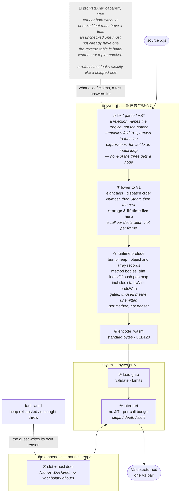

# tinyvm PRD

Parent: [`~/repos/index.md`](~/repos/index.md) —— 跨仓记忆宫殿。本文是产品级宫殿；
同一套纪律：一个事实一个归属、只链不抄、判断被推翻留撤销记录、`[x]` 是**有证据的
承诺**而不是自我评价（本仓用 `prd_x_leaves_have_suite_edges` + `LEAF_TESTS` 执行这条，
它是这条纪律的金丝雀）。

便携可编程核。写一次，多平台，高性能。

Execution plan: [tinyvm as an iOS game runtime foundation](../plan/goal-tinyvm-ios-game-runtime.md)

笔记：[底层性能](notes-performance.md)

## 产品句

政委 2026-08-22：做得好是刚性需求。自己要一颗融合 qjs+wasm 的跨架构引擎，像自己的 JVM/V8：写一次，多平台，高性能。

便携可编程核。超级应用「跑程序」必须经此：`eval_wasm(data, globals, locals)`，装载期校验，宿主资源上限，无 JIT 也能活（含 iOS）。
对齐 JVM（校验+上限+同语义），不对齐 V8（JIT+完整 JS）。qjs 糖是皮，wasm 是核。

语言层在 `tinyvm-qjs`：`.qjs -> .wasm` 纯 Rust 编译器 + 皮 `eval_qjs = qjs2wasm + eval_wasm`。
容器 / 市场后加。

## 纪律

- 核只吃 wasm 字节。globals/locals 是宿主门，不是 POSIX。
- 一个 wasm 一个插件。插件只经宿主门，互不见。
- 不搬 V8 / workerd / QuickJS 源码。借 Cloudflare Workers 分层（隔离槽 / 语言皮 / 宿主门 / 上限在核 / 容器后加）。
- 槽 B（桌面 AOT 成本机码）停。dyn / #78 不进本产品。
- 测试优先：先验收测再改脸。套件跟着产品句长。工人自报不算过。
- 2026-08-22 起写刀在本仓。agenterm 不再持有 tinyvm 源，只作为下游 embedder。

## Product definition

`tinyvm` 是自有、跨平台、可预算的标准 WebAssembly 解释器，也是
TinyArcade 的运行底层。它接收普通 `.wasm`，在不生成或装载动态机器码的前提下完成
decode、validate、instantiate 和 execution；宿主通过标准 import table 提供版本化能力。

TinyArcade 是第一个 embedding 和持续验收负载，不是 VM 的语言边界。游戏便利能力必须
表现为标准 Wasm 或显式、版本化的 host import，不能演化成私有 opcode、私有卡带字节码
或只服务某一款游戏的解释器分叉。

目标结果是：iOS App 可以装载一枚经过审核的标准 `.wasm` 卡带，创建一个有界、持久的
instance，逐帧驱动游戏，安全 suspend/resume；单枚坏卡带只能失败自身，不能拖死、越界
分配或破坏 App。

## 记忆宫殿：一段 `.qjs` 走到宿主门的七个房间

树说「有什么」，图说「东西放在哪」。每个房间放一件**只属于它**的知识，判据是
**它随什么变**：随 JS 语言或 wasm 规范变的，在本仓；随某个 embedder 的业务变的，
不在本仓。这条判据就是编译器归属那次讨论的结论，也是 `compile_qjs` 至今不认识任何
embedder 词汇的原因。



**房间 ③ 是最容易放错的一间**，而且有两种放错法。

**一、放进无条件的那一格。** `runtime::SET` 是无条件的——`Rt::offset()` 是它在那个切片
里的下标——所以往里加一臂就是给每个模块加一臂。数组落地时 `__typeof` 和 `__truthy`
的 Array 臂正是这样被加进去的，**每个程序多付 11 字节**，包括 `return 1;`。
门控的先例是 `convert::JSON_SET`，谓词**精确**：名字出现。数组的精确谓词是
「有 ArrayLiteral 节点，或程序提到 `JSON`」——后者不能省，因为 `JSON.parse` 能从
编译器看不见的文本里造出数组。

同一格还咬过第二次：`__len` 在这里有身体、却没有任何调用点，**每个模块白背 19 字节**，
直到 `"ab".length` 落地才被发现。**无条件的集合应当定期扫一遍死成员。**

**二、门装错了层。** 方法落地时，门第一版装在**整个集合**上，于是只写 `trim()` 的程序
要为 `indexOf` 付 307 字节。门该装在**每件家具**上，不是房门上。

**三、家具放进了别的房间——这是最贵的一种。** `a.map(f)` 的循环最初内联在**房间 ①**
的每个调用点上，因为大家都以为「房间 ③ 的家具够不到房间 ⑥ 的函数表」。
**那条前提是错的**：把统一签名的 type index 交给 prefab 层就行。循环搬回房间 ③ 之后，
每调用点从 162 字节降到 48。

第三条的教训超出体积：`research/method-binding/` 那场三选一的判决，**结论本来会反过来**
——一个方案之所以看起来输，只是因为它的家具被放在了错误的房间里。
**放错房间不只是代价问题，它会让你把结构问题误读成方案优劣。**

**四、树自己也会放错，而且有两个方向。** 前向金丝雀（`prd_x_leaves_have_suite_edges`）
防的是 `[x]` 吹牛；2026-08-29 一天抓到四片叶子反过来——测试早就在，叶子还写 `[ ]`。
反向那条（`prd_unchecked_leaves_are_not_already_done`，`f4bf11f`）**不能按主题猜**：
`parse_int_is_not_silently_number` 是一条**拒绝**测试，按主题看和「做了 `parseInt`」
一模一样，所以表是手写的，每片开着的叶子预先登记它做成时会存在的测试名。
**它自己的注释又放错了一次**——说 `push / map` 那两行在 `7c4f9dc^` 时还是 `[ ]`，
其实那只在下游 PRD 里发生过，本文件第 501 行一直是 `[x]`。没有金丝雀核对金丝雀的注释，
这条靠人读出来，还没改。（写这一段时又被它咬了一口：它读**每一个** fence，
不只能力树那个——上面 mermaid 里一个带记号的标签，一分钟内就被前向金丝雀点名了。）

---

**房间 ② 有一种和 ③ 完全不同的放错法：东西放对了房间，但放在了房间里错误的时刻。**

2026-08-28 的每轮绑定分歧就是这一种。捕获绑定的 cell 分配确实属于房间 ②——存储与
生命周期是降级的事，不是解析的事，也不是运行时预制件的事。它没放错房间，
**它放错了时刻**：开在**函数入口**，而 ECMA-262 14.3.1 说绑定属于**声明这条语句**。
一个函数一格，于是循环体三趟写同一格，三个闭包读出同一个值——`222` 而不是 `012`。

这种放错法比 ③ 那三种更难发现，原因写在判据里：**它不报错。**
少一个特性会在房间 ①「大声拒绝」，付错字节会在门控实测里露出来，
而这一条给出的 `333` 与正确的 `012` 都是合法输出，**没有任何一道门会响**。
它是靠「排 `for-of` 的队时顺手实测了一下将要复用的东西」才掉出来的。

同一天它还自己复发了一次，形状一模一样。第二步把脚本绑定改成捕获时，
`place()` 先判的是「这个绑定属于谁」（`func == SCRIPT`），于是**闭包内部**读它
也拿到了全局——读到的正是「最新那个 cell」，也就是要修的那个共享答案。
正确的问法是「**谁在读**」：脚本读全局，嵌套函数读自己的环境。
**一个决定有两个答案时，先问的必须是「谁在问」，不是「这是什么」。**

所以这张图上要补的一格判据，是在「东西放哪间」之外的：
**在这一间的什么时刻，以及为谁。**

---

**图外一课：语料的归属先于任何普查。** 2026-08-29 两次需求普查拿下游 82 个 `.rh` 脚本
当语料排了八个里程碑。同一份数据，一天之内换了三个前提——「本产品的脚本」→
「另一个仓的脚本」→「本产品要迁移过来的脚本」——结论跟着翻了三次，
而数据一个字没变。**每一次翻转都来自一句我问不出、只能等的产品判断。**
所以普查的第一行不该是数字，该是「这批语料是谁的、要拿它做什么」；
答不上来就把两种读法**并排写**，不选一种当唯一结论。

---

**房间 ① 有一种反过来的用法，`for…of` 是第一个例子：把本该在房间 ③ 的东西，
用房间 ① 已有的词汇写出来，于是房间 ③ 一个字节都不用加。**

`for…of` 需要一个运行期检查——「右边到底是不是数组」，编译期答不了。
直觉的做法是给房间 ③ 加一个预制件，再给它配一道门。实际做法是发现
**这个检查可以完全用子集里已有的语句写出来**：`typeof S === "string"`、
`typeof S !== "object"`、`S === null`、`typeof S.length !== "number"`，
四道 `if` + `throw`，全是房间 ① 折出来的普通语句。
于是房间 ③ 没变，零成本门不需要谓词——**没有门要维护，因为没有东西要门控**。

这条和上面三条「放错房间」是同一枚硬币：**先问这件事能不能用已有房间的词汇说出来，
再决定要不要新开一格。** `map` 那次的教训是「够不到」这个前提要实测；
这次的教训是「说不出来」这个前提也要实测。

顺带记一条守卫的**顺序**教训，它不在任何一间房里，在语言本身：
四道守卫第一版只写了最后一道，结果 `for (const x of 42)` 在读 `42 .length` 时
**先 trap 了**（原始值上取属性走 `require_tag` 到 `unreachable`），
连抛都没轮到，`catch` 什么也看不见。**一道守卫必须先把类型收窄到它自己不会炸的范围，
才轮得到它去判断。**

## 语言路线图的依据（两次普查，2026-08-28/29，已归档）

两次普查的语料是下游 82 个 `.rh` 脚本——**另一个产品的语料**（政委 2026-08-29 更正），
所以「按那张表排序」这条依据不成立，两次排序一律降为历史记录；**照普查落地的八个里程碑保留**
（模板、箭头、`.length`、方法、每轮新绑定、`for…of`、模块、字符串方法、`Number`——每个都是通用
JS 能力，有实测与门控）。普查本身、排队时撞见的「循环不给每轮新绑定」、`break`/`continue` 与
`replace`/`replaceAll` 那一批、假阳性更正、两条「数完之后决定不做」的推理，见
[归档](archive/PRD_history_2026-08.md#语言路线图的依据一次需求普查2026-08-28)。
数字结论都在待办 B 区的表里。`.qjs` 今后的需求从 `.qjs` **自己的用途**里来——下游待办 A1。

## 原生降级（AOT / JIT）：一个被重新提出的方向，尚未立项

**产品定义至今是排除的**：「对齐 JVM（校验+上限+同语义），不对齐 V8（JIT+完整 JS）」，
能力树里 `JIT native code` 与 `device-side AOT` 都是 `[–]`。

**2026-08-28 政委重新提出**：桌面端未来仍会要 JIT/AOT 优化。同日在 agenterm 侧实测，
同一份 wasm、同一个答案、纯计算 2000 万轮：**wasmtime 30.1 ms，tinyvm 16.08 s，535×**；
交叉点约 **1500 轮**真实计算（tinyvm 启动便宜、线性；wasmtime 几乎平）。
`agenterm-wasmcore`（wasmtime）同日按需求归档，所以那条 JIT 路径**不再存在**——
要它就得从本仓这条自研线上长出来。

**四条在立项前必须写清楚的**：

1. **应当先做 AOT，不是 JIT。** 下游 `qualify` 已经是「源码 → 自足产物 + 收据」的
   AOT 形状，接一段原生降级严丝合缝；JIT 要运行期代码缓存、W^X 页与预热，
   是产品现在没有的生命周期。**且 iOS 上 JIT 不可能、AOT 可以**——
   AOT 一套故事通吃，JIT 会把产品劈成两套，而本仓的目标正是 iOS 基座。
2. **真正的未知数是「预算能不能活下来」，不是「能不能发机器码」。**
   本核相对 JIT 引擎的全部优势就是 `steps / depth / pages / slots` 与**确定性收据**。
   原生代码必须把计步**插桩**进去；做不到，收据失去意义、沙箱失去上界，
   那就等于把刚刚归档掉的那个引擎的缺点买回来。**这该立判决性实验**
   （`.claude/skills/decisive-experiment`），判据就是「插桩后的步数是否仍然确定、
   代价是多少」——不是一张功能票。
3. **规模要诚实**：原生降级 = 每个 ISA 一个后端（x86-64、aarch64）。
   这会是本板上最大的一项。
4. **先数需求。** 535× 是拿**纯计算循环**量的；agenterm 的真实脚本是 **I/O 形状**
   （过 `agenterm.*` 门），不是计算形状。2026-08-28 那一轮已经三次
   「假设有需求、实测为零」（方法、GC、`eval`）。**先找出一个真的跨过 1500 轮的载荷**，
   再谈后端。

**状态：候选（未立项）。** 按 `decisive-experiment` §6 的资格，
候选**不得写结论**——上面每一条都是待验证的输入，不是判决。

## 待办清单（`/goal` 可直接引用这一节）

**这一节存在的理由**：2026-08-29 被问「真的做完了吗」，答案是没有，而当时**没有一处
地方能一眼答出还剩什么**——能力树里既有已做却仍标 `[ ]` 的（`break`/`continue`、
`split`），也有做不了却和能做的混在一起的（真机 iPhone）。清单把两者分开。

**怎么用**：`/goal` 引用本节时，「完成」= 下面每条要么状态变 `[x]`，
要么在本表里带一个**实测数字**写明为何不做。**外部阻塞不算未完成，也不得作为停止的理由。**

### A. 现在就能做，做完可核对

| # | 事 | 为什么（实测） | 做完算什么 |
|---|----|---------------|-----------|
| ~~A1~~ | ~~核里 16 条红测试逐条归因~~ **已归因（2026-08-29）** | 16 条 = **13 条卡带**（缺 `wasm-opt`，Binaryen 未装）+ `fan_c`（clang 的 wasm 链接器缺）+ `webkit`（JSC 差分脚本）+ `ios_wasi_host`（模拟器容器脚本） | **全是本机缺工具链，无一是代码缺陷**。装 Binaryen 与 wasm-ld 后复跑；装不了就在此行写「未跑」 |
| ~~A2~~ | ~~金丝雀补成双向~~ **已闭合（2026-08-29 收尾）** | 前向：`[x]` 有没有测试；反向：`[ ]` 是不是其实做了（`STALE_HINTS`） | 那句错注释已改（`push / pop / map` 在本 PRD 早是 `[x]`，只在下游陈旧过——注释现在这么说）；hex/octal/binary 落地当天把它的反向行改成回归行、开着的叶改成「numeric separators」；负控制（`[x]`→`[ ]` 一条 → 测试红、点名）2026-08-29 复跑过 |
| ~~A3~~ | ~~Status 行的版本与测试数上门~~ **已上门（agenterm `bc1a22d5`），且已咬过一次（2026-08-29）** | PRD 36 首行停在 rev `0afc88a`/153，实际 `ec67034`/152，靠人问才发现 | `the_prd_states_the_revision_this_build_pins`：抬 pin 到 `94237cb` 时 PRD 还写 `ec67034`，`cargo test -p agenterm-qjswasm` 红，同一提交里改链才绿——门第一次真的响了 |
| ~~A4~~ | ~~一个真实 App target 消费 XCFramework~~ **已落地（2026-08-30）** | 验收 #5；此前打包与冒烟已绿，只是仓里没有工程 | 工程由 xcodegen 从仓内 `bindings/swift/app/project.yml` 生成到临时目录（可复现，不提交 `.xcodeproj`），SwiftUI 应用 `import TinyArcadeRuntime` 并调用 `TinyArcadeCartridgeDescriptorV1.inspect`；`smoke-ios-bridge.sh` 为模拟器与真机各构建一次（`CODE_SIGNING_ALLOWED=NO`，不要设备）并检查 `.app` 存在——exit 0；`tests/ios_app_target.rs` 钉住规格与冒烟步骤在仓里 |
| ~~A5~~ | ~~验收 #4：两个结构不同的游戏跑通确定性回放~~ **已绿（2026-08-30）** | 相关测试原在 A1 的 16 条里，全部是工具链缺席 | 装齐工具链后核套件 **314/1**：Paddle Guard、Signal Lock、Depth Well 三个卡带的确定性回放、暂停恢复、转换器元数据全部通过；`build-c-cartridge.sh` 学会在没有 `wasm-ld` 时用 `zig cc`（triple 写成 `wasm32-freestanding`）；`smoke-webkit-differential.sh` 自己找 Chromium 系浏览器。剩下的红（若有）是浏览器/模拟器这类环境项，写在验证口径里 |
| ~~A6~~ | ~~`print(非字符串)` 等宿主参数解包在运行期裸 trap~~ **已报名字（2026-08-29）** | `print(s.length)` 编译期不拒（类型是运行期事实），以前在 `unwrap_args` 落进 `unbox_string` 的裸 `unreachable` | 客人写 `"<host>#<n>"` 进 detail 字 + 第六个 fault code；`guest_host_argument` 读回；字面量 String 参数**不再发射标签测试**（比以前更小），其余每个 String 参数位 +~12 B；`I32`/`F64` 参数位同样报名字；`tests/host_argument.rs` 6 条 |
| A7 | 嵌套闭包 + 调用 `import` 进来的函数 → wasm 校验失败 | 下游第一波迁移六组之一测到：`loading wasm: validation: type mismatch`；顶层函数与顶层 try 没事，入口因此都写成平的 | **11 种形状都过**（返回的闭包、`map` 回调、`try` 内、两层嵌套、箭头、字符串参数——`tests/closures_call_imports_m3.rs`，2026-08-29）；报告里没有原始源码，暂不能复现。谁再撞到，把那段脚本贴进来。**2026-08-30 晚补的下半截**：再撞到时不用再二分——`Module::from_bytes_explained` 在校验函数体失败时答出**是哪个函数**（索引 + `name` 段里的名字；编译器早就把每个函数的名字写进 `name` 段了，只是没人读），`LoadError` 显示为 `validation: type mismatch in function \`broken\` (#2)`；旧入口的 `WasmError` 原样不动（`Copy`、无分配）；`tests/explained_load.rs`。**再补行号（同日深夜）**：编译器在 `name` 段旁边写一个 `qjs.lines` 自定义段（函数索引 → 1-based 源码行，词法器按 ECMA-262 LineTerminator 数行，`import` 进来的模块按它自己的源码数），`from_bytes_explained` 读进 `FunctionSite.line`，显示成 `… in function \`broken\` (#2) (line 7)`；脚本本身与运行时函数不列（前者永远是第 1 行，后者作者打不开），所以没有函数的程序字节不变、有函数的每个 +17 起（`tests/lower_m2.rs` 独立读取器、`tests/explained_load.rs` 手拼段）；静态核不变 |
| ~~A8~~ | ~~`undefined.x` 不可捕获~~ **已可捕获（2026-08-29 深夜）** | ECMA-262 是可捕获的 TypeError；以前是 `unbox_object` 裸 trap，`try/catch` 看不见 | 运行时 `Ctx` 现在知道 unwind 通道；`__obj_get` 对非对象接收者在有通道时抛一个 String（`TypeError: cannot read property 'x' of a value that has no properties`）并答 undefined，三处属性读调用点之后加 `throw_check`；扫描期 `try` 也开通道（之前只有 `throw` 开）。无 `try` 的程序仍是具名 fault，`"return 1;"` 字节不动；`tests/catchable_type_error.rs` |
| A9 | V1 装箱下的步数价格 | **实测（2026-08-29，下游 CLI 二分 `--max-operations`，扣除空程序 101 步）**：循环一次 **146**；`"" + n` **≈5 200**；`s = s + "x"`（串在长）**≈8 800**；`includes` **≈127/字符**；`JSON.parse` **≈520/字节**；`JSON.stringify` **≈700/字节**；`slice(0,10)` 于 1 000 字符 78 000 → `83721d0` 后 <3 000 | 表已进 PRD；`num_to_string` **已动**（`27d67b4`：整数走位数循环，537 步，下游 CLI 复测 ≈400）；`JSON.parse` **已动**（`json_pnum` 整数一趟：1 600 → 527 步/个；`json_pstr` 字符串四字节一步：119 → 29 步/字节；`plan/design-json-parse-fast.md`）；小数也已（`1.5`：1 336 → 539）；指数、短键、`__jp_at` 每位一次是下一层；**`s + "x"` 已动（2026-08-30）**：`__str_concat` 的复制循环八字节一步（`copy_loop`），1 000 字符串追加一字 **17 178 → 2 569 步**（`tests/concat_cost.rs` 钉 <3 000）；所有字节钉 **+85**（`__str_concat` 人人都带）；`plan/design-concat-word-copy.md`；**`JSON.stringify` 引号串已动（2026-08-30）**：`__json_quote` 整段平凡字节交给 `__jb_bytes`，只逃逸截断的那个字节，1 000 字符 **117 → 39 步/字节**，50 个小对象 254 311 → 224 381 步（剩下的是属性遍历，每对象 ≈4 500）；只有点名 JSON 的程序付 +83 字节；`tests/json_stringify_cost.rs`；**`.length` 已动（2026-08-30）**：`__len` 八个纯 ASCII 字节一步（两个 i32 load 或起来看高位），6 000 字符 **180 346 → 19 854 步/次**（原来 30 步/字节，`for (i < s.length)` 是二次的）；能到串 `.length` 臂的程序 +58 字节；`tests/length_cost.rs`；下游：`append_command_record` 每次 ≈970k 步里 `.length` 占 ≈300k。**再下一层（2026-08-30 量过，未动）**：`JSON.stringify` 每元素——`{}` 399、每个属性 ≈+700（键的引号 ≈300 固定 + ≈68/字符）、数组元素 ≈385、`12345` 814、`"item"` 670、`[]` 整次 1 129；这是逐节点的解释常数，没有单个热点，要再降得改属性遍历本身。**`includes` / `indexOf` 未命中：128 KiB 串上实测 35.7 / 38.7 步/字符**（下游 lint 一个仓 13.9 MB × 7 次 = 3.5G 步；lint 已改宿主扫，但按字扫首字节（`haszero` 位技巧，指令集没有 i64 and/xor，得用 i32 双字与 `(a|b)-(a&b)` 拼）能再降一个量级，是下一个价格项）——**已动（2026-08-30 晚）**：四字节窗跳过，36 → **7.2 步/字符**，`plan/design-index-of-window-skip.md`，`tests/index_of_cost.rs` 钉 <10；同一晚 **`toLowerCase` ASCII 快路 393 → 38 步/字符**（`54b13ce`，`tests/to_lower_case_cost.rs`）、**`split` 位置循环同一个窗跳过 73 → 26**（无分隔符段）——三个都是下游 qualification 门（lint、prd-alignment）撞出来的。**下游旅程剖面（2026-08-30 深夜，agenterm `plan/design-host-op-budget.md` §7）**：server-smoke 31.2M 步 = `JSON.parse` 48%（22 份美化打印的答复 225 KB 共 13.56M，**58–64 步/字节**：空白 **39/字节**、每个键/串 **≈760 固定** +24/字节、5 键对象每成员 ≈1 600）+ `JSON.stringify` 28%（每条记录 39k–97k；**13 位整数 `1788101436756` 一个 32.6k**——超 i32 离开位数循环）+ 拼接 7% + 脚本 17%；真实答复与真实记录进程内逐个定价，`tests/json_parse_cost.rs`（美化答复、空白、短串）与 `json_stringify_cost.rs`（30 属性平对象 1 180/属性、记录 82k、时间戳）钉着现价。**`JSON.parse` 第二夜已动（同夜）**：`__jp_ws` 自己装载、`\n` 后的缩进四空格一字再两个（1 000 空格 39 → **14**，缩进行 **7/字节**）；`__json_pstr` 先用新的 `__jp_run` 量整段，段尾是 `"` 就直接 `alloc` 成记录（`"ab"` 758 → **591**，十字符键 956 → 751）；真实答复 **13.56M → 8.45M（−38%）**，protocol-info 64 → 42、bootstrap 58 → 35 步/字节；JSON 程序 +353 B；`plan/design-json-parse-fast.md` 第二夜 |
| ~~A10~~ | ~~调用非函数是无名 trap~~ **已做（2026-08-30 晚）** | `undefined(1)`、`o.missing()`、`[].concat()`、`(3)()` 都只答 `unreachable executed`——`unbox_function` 的 `require_tag` 直接 trap，每个间接调用点一份 | 有通道时是可捕获的 `TypeError: <name> is not a function`，无通道时 fault 8 + 名字（`guest_not_a_function`）；`__call_check` 与「答 `undefined` 的蹦床」只在有间接调用的程序里发射（自己的集合、自己的表元素），`"return 1;"` 不动，有闭包的程序 +153、每个调用点 −16；参数先于检查（13.3.6.1）；第一版两次错（栈形状、无条件集 +19）记在 `plan/design-call-check.md`；`tests/not_a_function.rs` 六种形状 × 可捕获/不可捕获 |
| A11 | **剩下的无名 `unreachable`，按「脚本能不能走到」分两堆** | 2026-08-30 晚数了 38 处。**脚本走得到的**（每个都该有名字或有答案）：(a) ~~`"" + {}` / `o[{}]`——对象/函数的 ToString 是无名 trap~~ **已命名（同晚，ToString 与 ToNumber 都是）**：`FAULT_NO_PRIMITIVE_FORM = 9` + 种类（`an Object` / `an Array` / `a function`），`guest_no_primitive_form`；`"" + o`、`o[k]`、`o * 2`、`-o`、`f + 1`、`f < 1` 一个名字；顺手删掉 `__to_number` 里两条挡在前面的无名臂（每个程序 −18 B，`"return 1;"` 10 025 → 10 007；`f + 1` 那行测出了它们在遮蔽有名臂）；**不给 ECMA 的答案**——引擎的既有原则「对象/数组/函数从不静默转换」由五个文件的测试钉着（第一版给了答案、被它们反过来，记在 `plan/design-to-string-of-objects.md`）；`tests/to_string_of_objects.rs`；~~(b) `split("")` 的孤立代理项；(c) `slice_core` 代理对中间的边界两处；(d) `array.rs` `prop_set` 两处 + `__obj_set` 的非对象接收者~~ **已命名（同晚）**：(b)(c) 仍是 `FAULT_CAPABILITY = 3` 但带名字（`guest_capability_name`：`split with an empty separator` / `a slice boundary inside a surrogate pair`，无名的老臂改为清零 `FAULT_THROWN`）；(d) 是脚本自己的事，`FAULT_INVALID_WRITE = 10` + 理由（`an Array key that is not an index below 16777216` / `a property write on a value that has no properties`），`guest_invalid_write`；门控 `scan.member_write`（新扫描位）/ `Me::Split` / `Me::SliceCore`；`tests/refused_operations.rs`；`plan/design-named-refusals.md`。`unbox_array_from` 与 `arr_set` 的 `MAX_INDEX` 守卫归入引擎自证（调用点已按 tag 分派 / `__arr_index` 先拒）。再加一处同晚补上的：宿主 `I32` 参数收到非整数（`at(1.5, 2)`）原是无名 trap，现与 String 参数同名 `FAULT_HOST_ARGUMENT` + `host#n`（`tests/host_argument.rs`）。**引擎自证的**那堆各自函数级文档已说明「脚本到不了」，不再逐处加 fault 码——每个码都进无条件运行时、每个程序都付字节，而没有脚本能读到它。**引擎自证的**（脚本造不出来，留 trap 但可加 fault 码「不是这个引擎造的对」）：`to_number` / `truthy` / `type_of` / `str_cmp` 的「没有第九个 tag」、`repr` 的手造对守卫、`length` / `__call_check` 门控关掉时的空身体 | ~~(a)(b)(c)(d)~~ 都已做（有名拒绝，不是答案；可捕获通道暂未接——TypeError 只在 `undefined.x` 与调用非函数两处有）；剩引擎自证的一律 `FAULT_ENGINE = 11` + 位置串（9、10 已占用）。做完：每个 `Unreachable` 前面都有 `store_fault` 或一句「脚本到不了」的注释，`grep` 数得出来 |

### B. 需求为零，**故意不做**（已带数字，不需再决策）

| 事 | 数字 |
|----|------|
| `switch` · spread · `do{}while` · 解构 · 默认参数 | 82 个脚本**零使用**（剥离字符串与注释后重数） |
| 跨 `finally` 的 `break`/`continue` | 语料 **1 处 1 脚本**；现为大声点名拒绝 |
| `toUpperCase` | `to_lower` 67 次，`to_upper` **0 次** |
| `parseInt` | 语义与 `Number` 不同，等按名需求，不做别名 |
| 具名导入 / 默认导出 / 再导出 / 动态 import | 下游 42 处 import **全是**命名空间形式 |
| hex / octal / 分隔符 · tagged template · `for … in` | 语料零使用 |

### C. 外部阻塞——**点名，且不得作为停止的理由**

| 事 | 挡在哪 |
|----|--------|
| 验收 #6：TestFlight 处理与可安装 | Apple 侧处理，需要开发者账号 |
| 真机 iPhone 生命周期 / 帧时 / 音频 / 输入手感 | 需要一台真机 |
| Apple 批准后的外部分发 | 同上 |

### D. 候选，未立项（要先立判决性实验才动）

> **区域式 bump（grok 评审 §3 的建议，2026-08-30）**：不做追踪 GC（要给每个模块发射访问器，杀掉「不用不发射」），而是在 `JSON.parse` / `stringify` / 一次门答复投影完成后**恢复水位**——只有调这些操作的程序才带这段前置件，与逐方法预制件同一纪律。立项前要先量：哪些旅程的堆是「垃圾」而不是「活着的答复」，以及水位恢复点能否安全（答复投影后没有指针再指向被丢弃的中间记录）。
> **形状赌注要重量**（评审 §1/§2）：对象布局的依据是 `fleet.js` 的两种对象（`runtime.rs:1620`）；`JSON.stringify` 每属性 ≈700 步就是这个赌注的价。等 agent 脚本有长寿对象、对象基数变了再付 hidden class 的钱，先量基数。

| 事 | 前置 |
|----|------|
| 原生降级（AOT / JIT） | 四条前置写在「原生降级」那节；先要找到一个真跨过 1500 轮的载荷 |
| typed function references · GC · memory64 · exception handling · threads | 各自要 fixture + 独立 oracle + 体积档，见 P2 |
| slot-B | 未定义 |

## Capability tree

Legend: `[x]` 已有可执行证据 · `[~]` 部分完成 · `[ ]` 规划 · `[–]` 有意排除

```text
tinyvm (35)                                      [~]
│
├── product boundary                                     [~]
│   ├── eval_wasm(data, globals, locals)                  [x]
│   │   └── eval / eval_with aliases                      [x]
│   ├── language skin (tinyvm-qjs)               [x]
│   │   ├── qjs2wasm names / ops / host-call subset       [x]
│   │   ├── eval_qjs = eval_wasm(qjs2wasm, globals, locals) [x]
│   │   ├── commissar demo (example commissar)            [x]
│   │   ├── V1 values across the call boundary            [x]
│   │   ├── declarations, functions, control flow         [x]
│   │   ├── `for … of` over an array (13.7.5)             [x] 折成索引循环，无新节点
│   │   │   ├── 元素每轮是新绑定                            [x] 白拿：声明在循环体里
│   │   │   ├── length 每轮重读，body 里 pop 会被看见        [x] 与数组迭代器一致
│   │   │   ├── 字符串 / 非数组按名拒绝，可 catch            [x] 不静默跑零轮
│   │   │   ├── 无声明形式 `for (x of y)`                   [ ] 目标可以是任意赋值目标
│   │   │   └── `of` 当标识符（上下文关键字）                [具名分歧] 词法器仍拒
│   │   ├── `for … in`                                    [ ] 要属性枚举，另一回事
│   │   ├── 模块：`import * as` + `export`（16.2）         [x] 编译期取入，仍是一个 .wasm
│   │   │   ├── 宿主给解析回调，编译器不碰文件系统          [x] 与「核只吃字节」同一条纪律
│   │   │   ├── 命名空间双向不漏（模块↔导入者）             [x] 判据 ③，两条测试
│   │   │   ├── 循环导入点名拒绝，不是栈溢出                [x] 判据 ④
│   │   │   ├── 无 import 的程序零字节                      [x] 判据 ②，与 closures 同一组数
│   │   │   └── 具名导入 / 默认导出 / 再导出 / 动态 import   [ ] 具名拒绝，需求为零
│   │   ├── `break` / `continue`                          [x] 见下方方法段的同名行
│   │   ├── object literals, property access, assignment [x]
│   │   ├── functions as values, stored/passed/called     [x]
│   │   ├── Number<->String conversion, per ECMA-262      [x]
│   │   ├── conditional expressions, try/catch/finally    [x]
│   │   ├── JSON.parse / JSON.stringify, per ECMA-262 25.5 [x]
│   │   ├── arrays: the eighth tag, a dense vector        [x]
│   │   │   ├── literal, a[i], .length, nesting           [x]
│   │   │   ├── out of range reads undefined, not a fault [x]
│   │   │   ├── a write past the end fills, no holes      [x]
│   │   │   ├── JSON reads and writes one                 [x]
│   │   │   ├── a string key is not an index (10.4.2.1)   [~] recorded divergence
│   │   │   ├── a non-index property write is a named refusal [x] fault 10, `refused_operations.rs`
│   │   │   └── methods: push / pop / map                 [x] see below
│   │   ├── an array-free program pays nothing for arrays [x] 9 784 -> 9 784 bytes
│   │   ├── an indexed read is 36.6x the object spelling  [x] 526 vs 19 235 steps
│   │   ├── closures that capture an outer local          [x] by binding, gated
│   │   │   ├── a write after the closure exists is seen   [x] not by value
│   │   │   ├── parameters count; any nesting depth        [x] flat closures
│   │   │   ├── two instances, two environments            [x] identity, observable
│   │   │   ├── a no-capture program pays nothing          [x] 21 fixed / 99 each
│   │   │   └── 一个声明执行两次 = 两个绑定 (14.3.1)        [x] 见下
│   │   │       ├── 函数内的 let / const（含 while / 嵌套块） [x] 012，cell 移到声明处
│   │   │       ├── 脚本层的 let / const                     [x] 012，循环内的改走捕获
│   │   │       │   └── 不在循环里的脚本绑定仍是 global       [x] 判据 ④：不许为它涨字节
│   │   │       ├── `for` 头部的 let 每轮复制 (13.7.4.7)      [x] 012，body 之后 update 之前
│   │   │       │   └── `while` 闭包看到末值                 [x] **对照**：333 是正确答案
│   │   │       └── 每多一个循环内被捕获的绑定               [x] +83 字节（斜率，已写成测试）
│   │   ├── the whole DecimalLiteral grammar (12.9.3)      [x]
│   │   │   ├── 1.5 · .5 · 1. · 1e3 · 2E2 · 1.5e-3         [x]
│   │   │   ├── integers past i32 and past 2^53            [x] nearest double
│   │   │   └── numeric separators `1_000`          [ ] own grammars
│   │   ├── template literals (13.2.8)                     [x] folded to `+`
│   │   │   ├── nesting; any expression in a substitution  [x] brace-depth stack
│   │   │   ├── TV normalises CRLF and lone CR to one LF   [x] 12.9.6
│   │   │   ├── a template-free program pays nothing       [x] byte-identical
│   │   │   └── tagged templates                           [ ] needs a raw array
│   │   ├── arrow functions (15.3)                         [x] = a function expression
│   │   │   ├── both parameter forms, both body forms      [x]
│   │   │   ├── the cover grammar, settled before parsing  [x] 13.2.2
│   │   │   ├── an arrow-free program pays no bytes        [x] and no compile time
│   │   │   └── **the equivalence is conditional**          [~] expires if `this` lands
│   │   ├── `"ab".length`                                  [x] UTF-16 code units
│   │   │   ├── counts units, not UTF-8 bytes              [x] café is 4
│   │   │   ├── every other String property still traps    [x] deliberate
│   │   │   └── a program without `.length` got smaller    [x] -19 bytes
│   │   ├── methods: trim indexOf push pop map             [x] binding **measured**
│   │   ├── includes / startsWith / endsWith               [x] 需求普查前两名
│   │   ├── split（非空分隔符）+ 共享的 substr 辅助件       [x] 426 字节
│   │   ├── toLowerCase（Unicode 区间表）                   [x] **8 836 字节**，价目公开
│   │   ├── `slice(start[, end])`：码元位置、负索引、NaN=0、共享核心             [x] 2026-08-29；756 B / 647 B / 两者 1 029 B；代理对内的边界 trap
│   │   │   ├── 不调用它的程序零字节                        [x] 表在门后
│   │   │   ├── 中文 / emoji / 已小写：原样返回不 trap       [x] 判据 ②
│   │   │   └── `İ` 一对多、词尾 `Σ`                        [具名] 两条，见决定文档 §4.1
│   │   ├── toUpperCase                                    [–] 语料零使用
│   │   ├── replace（首个）/ replaceAll（全部）             [x] 525 + 515 字节，各发射一份
│   │   └── `break` / `continue`（无标签）                  [x] continue 自带标签，按需发射
│   │       └── 跨 `finally` 的 break / continue            [–] **先数后决定不做**：语料 1 处
│   │   ├── 第四类 fault code：运行期能力边界                 [x] 7 字节，只有到那条臂的程序付
│   │   ├── `Number(x)`：折成 `+x`，零运行时                 [x] 缺的只是名字，转换早就有
│   │   ├── `Object.keys(o)`：折成 `o.__keys()`，门控 prefab  [x] 208 字节；迁移语料 12 处
│   │   │   ├── 第三种接收者：调用点原只分「数组 / 否则字符串」 [x] 对象接收者曾落进 String 拒绝
│   │   │   └── `for … in`                                    [–] 458 处 for-in 里 352 是数组、172 是区间、12 走 keys()
│   │   │   └── `parseInt`（前缀解析 + 基数）                [ ] 不同函数，按名等需求
│   │   └── spread · switch · do-while · 解构 · 默认参数     [–] 语料**零使用**（假阳性已更正）
│   │   │   ├── 空片段保留（前导 / 尾随 / 连续分隔符）      [x] 最容易漏掉的边界
│   │   │   └── split("") **trap**：孤立代理 UTF-8 表示不了 [具名] **应带第四类 fault code**：下游第一个真脚本撞上时只见裸 unreachable
│   │   │   ├── 字节层比较，对多字节字符精确               [x] é 与 😀 钉住
│   │   │   └── includes 不经由 indexOf，因此更便宜         [x] 320 vs 440 字节
│   │   ├── split [x] · toLowerCase [x] · toUpperCase      [–] 前两个已落地，后者零使用
│   │   │   ├── the mechanism was decided by experiment    [x] research/method-binding
│   │   │   ├── trim covers all of Zs + LineTerminator     [x] 12.2 + 12.3
│   │   │   ├── indexOf positions agree with .length       [x] UTF-16 units
│   │   │   ├── map calls back into a function value       [x] a prefab **can**
│   │   │   ├── a plain object's same-named property wins  [x] run-time receiver
│   │   │   ├── adding a method costs non-callers nothing  [x] per-method gate
│   │   │   └── every other method                          [ ] one row + one body each
│   │   ├── host calls with declared raw signatures       [x]
│   │   │   └── a host length answer must be a length    [x]
│   │   ├── nesting bounded by a diagnostic, not an abort [x]
│   │   ├── every rejection names the engine boundary     [x]
│   │   ├── an exhausted heap is legible, not a bare trap [x]
│   │   ├── an uncaught throw is legible, not a bare trap [x]
│   │   │   └── the thrown String itself is host-readable (`FAULT_THROWN` pointer, `guest_thrown_message`) [x] 94237cb；下游 agenterm `2cde8b63` 打印它
│   │   ├── a missing String property names itself at run time (`FAULT_MISSING_STRING_METHOD`), not a bare trap [x] 2026-08-29；`slice`/`substr`/`substring` 曾是三个「不同的 bug」
│   │   ├── a host argument of the wrong type names the call and the position (`FAULT_HOST_ARGUMENT`) [x] 2026-08-29；字面量 String 参数不再带标签测试
│   │   ├── a property read off undefined/null/a primitive names the key (`FAULT_PROPERTY_OF_NON_OBJECT`) [x] 2026-08-29；仍不可捕获（A8），但不再哑
│   │   ├── inside a `try`, that read is a catchable TypeError (a String) [x] 2026-08-29；`try` 本身就开 unwind 通道；无 `try` 仍是具名 fault
│   │   ├── `0x`/`0o`/`0b` number literals（无位数或超 64 位具名拒绝） [x] 2026-08-29；Win32 常量不必再写十进制
│   │   ├── reserved words as property names（`o.class`、`{ do: 1 }`） [x] 2026-08-29；`.` 后与 `:` 前是 IdentifierName
│   │   ├── the acceptance library runs through a host door [x]
│   │   └── full JS engine / AOT                          [–]
│   ├── host                                              [x]
│   ├── <100KiB>                                          [x]
│   └── iOS runtime boundary                              [x]
│   └── a real App target consumes the XCFramework (xcodegen, both destinations) [x] 2026-08-30 验收 #5
│       ├── interpret wasm                                [x]
│       ├── JIT native code                               [–]
│       ├── device-side AOT                               [–]
│       ├── dyn native loading                            [–]
│       └── H5/JS/WKWebView                               [–]
│
├── tinyvm engine                                        [x]
│   ├── scalar WebAssembly                                [~]
│   │   ├── control                                       [x]
│   │   ├── parametric                                    [x]
│   │   ├── locals                                        [x]
│   │   ├── memory                                        [x]
│   │   ├── i32                                           [x]
│   │   ├── i64                                           [x]
│   │   ├── f32                                           [x]
│   │   ├── f64                                           [x]
│   │   └── conv                                          [x]
│   ├── standard proposal profile                        [~]
│   │   ├── bulk memory copy/fill                         [x]
│   │   ├── bulk memory passive lifecycle                 [x]
│   │   ├── sign extension proposal                       [x]
│   │   ├── nontrapping float-to-int                      [x]
│   │   ├── multi-value proposal                          [x]
│   │   ├── single-table funcref profile                  [x]
│   │   ├── multiple defined funcref tables               [x]
│   │   ├── multiple internally defined memories          [x]
│   │   ├── extended constant expressions                 [x]
│   │   ├── tail-call proposal                            [x]
│   │   ├── SIMD proposal                                 [~]
│   │   │   ├── byte shuffle/swizzle                      [x]
│   │   │   ├── integer lane comparison masks             [x]
│   │   │   ├── integer all_true/bitmask reductions       [x]
│   │   │   ├── integer lane min/max + unsigned average   [x]
│   │   │   └── narrow-lane saturating add/sub            [x]
│   │   ├── typed function references                     [ ]
│   │   ├── GC proposal                                   [ ]
│   │   ├── memory64 proposal                             [ ]
│   │   ├── exception handling                            [ ]
│   │   └── threads/shared memory                         [ ]
│   ├── strict load gate                                 [~]
│   │   ├── decode complexity budget                      [x]
│   │   ├── strict declared-memory semantics              [x]
│   │   ├── strict memarg alignment                       [x]
│   │   ├── canonical function expression structure       [x]
│   │   ├── strict i64 signed-LEB range                   [x]
│   │   ├── valid custom-section names                    [x]
│   │   ├── empty memory-section vector                   [x]
│   │   ├── mutable global.set target                     [x]
│   │   ├── strict untyped select value domain             [x]
│   │   ├── export-declared ref.func                       [x]
│   │   ├── imported-global element expressions            [x]
│   │   ├── WABT load-gate oracle                         [x]
│   │   ├── static module validation CLI                  [x]
│   │   └── a refusal names the function, its name and its source line [x] `from_bytes_explained`：`name` 段 + `qjs.lines` 段，静态核不读
│   └── bounded execution                                [~]
│       ├── persistent instance                           [x]
│       ├── start once                                    [x]
│       ├── per-call fuel                                 [x]
│       ├── explicit guest call stack                     [x]
│       │   ├── host-owned call-depth ceiling             [x]
│       │   ├── host-owned activation-slot ceiling        [x]
│       │   ├── fallible execution-stack growth           [x]
│       │   └── one trap message per ceiling              [x]
│       ├── memory budget                                 [x]
│       ├── table budget                                  [x]
│       ├── deterministic execution stats                 [x]
│       │   └── call/activation peak telemetry            [x]
│       └── in-guest throughput gate                      [x]
│           ├── ns per guest instruction, eight shapes    [x]
│           ├── WABT agrees before any timing is believed [x]
│           └── load-time lowering / stack-top caching    [ ]
│
├── standard host and linking                            [~]
│   ├── owned host ABI                                   [~]
│   │   ├── typed standard function imports               [x]
│   │   ├── bounded in-place host dispatch                [x]
│   │   ├── indexed guest-memory callback context          [x]
│   │   ├── domain + generation guest resource handles     [x]
│   │   ├── bounds-checked guest memory windows            [x]
│   │   ├── two-pass variable-length host result           [x]
│   │   └── string-free fault classification               [x]
│   │       └── every allocator refusal reads Allocation  [x]
│   ├── standard resource imports                        [~]
│   │   ├── standard imported globals                     [x]
│   │   ├── standard imported linear memories             [x]
│   │   └── store-owned imported funcref tables           [x]
│   ├── standard resource exports                        [~]
│   │   ├── linked exported globals                       [x]
│   │   ├── linked exported memories                      [x]
│   │   └── linked exported tables                        [x]
│   └── cross-instance functions                         [~]
│       └── linked exported functions                     [x]
│           ├── numeric value signatures                  [x]
│           ├── store-owned funcref values                [x]
│           ├── opaque externref function/global values   [x]
│           └── standard externref tables                 [x]
│
├── game runtime                                         [x]
│   └── game ABI                                         [x]
│       ├── standard .wasm cartridge                      [x]
│       ├── manifest compatibility                        [x]
│       ├── core v1 imports                               [x]
│       ├── init/tick/suspend/resume                      [x]
│       ├── portable state snapshot                       [x]
│       ├── bounded frame output                          [x]
│       │   ├── recyclable host buffers                   [x]
│       │   └── stable two-pass copy lengths              [x]
│       ├── native module registry                        [x]
│       │   └── atomic resource-table factory             [x]
│       ├── App Store bundled-only gate                   [x]
│       └── machine host profile                          [x]
│           ├── catalog profile binding                   [x]
│           ├── exact zero-budget channel semantics       [x]
│           ├── profile-bound descriptor return           [x]
│           ├── typed compatibility issue report          [x]
│           └── exact-build Wasm feature negotiation      [x]
│
├── native I/O surface                                  [~]
│   ├── indexed2d presentation                           [~]
│   │   ├── bounded app metadata hot path                 [x]
│   │   ├── scoped immutable frame views                  [x]
│   │   └── single-buffer RGBA expansion                  [x]
│   ├── grid3d presentation                              [x]
│   │   └── allocation-free typed cell iteration          [x]
│   ├── tones playback                                   [~]
│   │   ├── bounded PCM tone synthesis                    [x]
│   │   ├── interruption / route / reset owner             [x]
│   │   ├── real App exact tone-event consumption          [x]
│   │   ├── single-buffer WAV + bounded wave LRU            [x]
│   │   └── physical speaker / headphone evidence          [ ]
│   ├── touch/keyboard/controller input                  [~]
│   │   ├── bounded multi-source aggregation              [x]
│   │   ├── Apple keyboard/gamepad adapter                [x]
│   │   ├── overlapping keyboard alias retention          [x]
│   │   ├── real App rising-edge input behavior           [x]
│   │   └── physical keyboard/gamepad evidence            [ ]
│   ├── scene lifecycle + persistence                    [~]
│   │   ├── real App shared session + frame pacer          [x]
│   │   └── protected prepublication snapshot replace     [x]
│   │       └── bounded prepared slot + borrowed restore slice [x]
│   └── physical-device lifecycle/audio/play             [ ]
│
├── evidence                                             [~]
│   ├── Depth Well grid3d                                 [x]
│   ├── Paddle Guard indexed2d                            [x]
│   ├── Signal Lock Swift-to-Wasm migration               [x]
│   ├── deterministic replay vectors                      [x]
│   ├── development JSC + H5 differential                [x]
│   ├── real iOS app consumer                            [x]
│   ├── TestFlight bundled-only candidate                [~]
│   │   ├── exact current-main upload                     [~]
│   │   ├── installed distribution identity verifier     [~]
│   │   └── Apple processing + physical install           [ ]
│   └── physical-device play                             [ ]
│
├── roadmap                                              [~]
│   ├── P0 — close product evidence                      [~]
│   │   ├── TestFlight processing + install               [ ]
│   │   ├── physical device lifecycle                     [ ]
│   │   ├── physical frame-time/resource evidence         [ ]
│   │   └── physical audio-session evidence               [ ]
│   ├── P1 — reusable native modules                     [~]
│   │   ├── generalize memory-zero call-scoped borrowing   [x]
│   │   ├── explicit selected-memory callback context      [x]
│   │   ├── unified host/guest handle lifetimes             [x]
│   │   ├── cross-runtime non-reused table domains          [x]
│   │   ├── native-resource snapshot quiescence             [x]
│   │   ├── versioned native import conventions           [x]
│   │   ├── converter-visible compatibility reports       [x]
│   │   └── platform-neutral host architecture            [~]
│   │       ├── contract / abstraction / backend split     [x]
│   │       ├── internal handles + preopen-only paths       [x]
│   │       ├── optional WASI Preview 1 adapter             [x]
│   │       │   ├── args + environ                           [x]
│   │       │   ├── clock + random                           [x]
│   │       │   ├── preopen discovery + fd_close             [x]
│   │       │   ├── fd read/write/seek/stat                   [x]
│   │       │   ├── path open/unlink                          [x]
│   │       │   └── proc_exit                                 [x]
│   │       └── platform backends outside VM                [~]
│   │           ├── capability-directory std backend         [x]
│   │           ├── iOS Simulator App container wiring        [x]
│   │           └── physical iPhone container evidence        [ ]
│   ├── P2 — accepted standard Wasm coverage             [x]
│   │   ├── proposal priority by real cartridge workload  [x]
│   │   ├── optional SIMD game-kernel subset               [x]
│   │   │   ├── narrow-lane saturating add/sub              [x]
│   │   │   ├── whole-vector bitwise masks                  [x]
│   │   │   ├── signed/unsigned integer comparison masks     [x]
│   │   │   ├── integer all_true/bitmask reductions          [x]
│   │   │   ├── integer lane min/max + unsigned average      [x]
│   │   │   ├── wrapping integer lane arithmetic            [x]
│   │   │   └── scalar/vector lane bridge                    [x]
│   │   ├── independent WABT/JSC differential per leaf    [x]
│   │   └── size/resource budget retained per leaf        [x]
│   ├── P3 — cartridge authoring ecosystem               [~]
│   │   ├── converter/conformance ecosystem               [~]
│   │   │   ├── versioned JSON host-compatibility report   [x]
│   │   │   ├── versioned JSON lifecycle conformance report [x]
│   │   │   └── versioned JSON replay conformance report    [x]
│   │   ├── representative replay publication gate          [x]
│   │   ├── fan-authored standard .wasm                   [x]
│   │   │   └── header-only C core v1 declarations        [x]
│   │   └── external distribution after Apple approval    [ ]
│   └── research queue                                   [~]
│       ├── QJWasm ownership + low-copy lessons           [~]
│       ├── unified host/guest handle lifetimes            [x]
│       ├── bounded call/callback/completion channels      [x]
│       ├── event-loop-neutral async completion ABI        [x]
│       │   ├── owner-thread completion queue core           [x]
│       │   ├── versioned guest import protocol              [x]
│       │   ├── C ABI channel ownership + late delivery      [x]
│       │   ├── Swift MainActor owner + host profile         [x]
│       │   ├── standard async cartridge fixture             [x]
│       │   └── booted iOS Simulator completion lifecycle    [x]
│       ├── cross-boundary copy/call benchmarks            [x]
│       └── JavaScriptCore remains development oracle     [~]
│
├── slot-B                                               [ ]
│   └── dynamic native execution                         [–]
│
└── non-goals
    ├── cu                                                 [x]
    ├── dyn                                                [–]
    ├── chassis                                            [x]
    ├── #78                                                [x]
    ├── WASI as implicit/default game host                 [x]
    ├── APE                                                [x]
    ├── WAT                                                [x]
    └── full JS engine in tinyvm-qjs              [–]
```

The first tree is executable product truth: every `[x]` leaf is backed by an owning
integration test or a three-edge golden family. `[~]` means the branch has useful
implementation but still lacks one or more stated acceptance gates; it must not be read
as “almost approved” or “safe to ship externally.”

## Product boundaries and invariants

### 1. Standard Wasm is the executable format

- The product face is `eval_wasm(data, globals, locals)`: `data` is a standard
  WebAssembly binary module (`\0asm`). `globals` bind the import table at the host
  door; `locals` are this call's arguments. `eval` / `eval_with` remain empty-gate
  aliases. WAT is a development source format, not a runtime input.
- `tinyvm-qjs` is the language layer: a staged `.qjs` -> `.wasm` compiler
  (lex -> parse -> AST -> IR -> encode) plus the skin that runs what it emits.
  `compile_qjs` is compile-only and generic — it knows nothing about any
  embedder's host door — and returns a `CompileError` naming the capability
  boundary and its byte offset. `qjs2wasm` is that compiler under
  `Names::HostImport`, where a bare name is a zero-argument `js.<name>` import;
  `eval_qjs` is `eval_wasm(&qjs2wasm(src)?, globals, locals)`, and its world is
  only those two bindings. The commissar demo is
  `cargo run -p tinyvm-qjs --example commissar`.
- `compile_qjs_m1` is the milestone above that skin, and the one the language
  grows on: statements, `let`/`const`/`var`, `if`/`while`/`for`, functions with
  parameters and `return`, strings, and the full operator ladder — every value
  of it a V1 pair, `(tag: i32, payload: i64)`, chosen by the measured experiment
  recorded in `design-value-representation-experiment.md`. Numbers are binary64,
  so `1/0` is `Infinity` and `2147483647 + 1` does not wrap. Its `main` takes two
  wasm parameters per JavaScript argument and returns two results; `Value` is the
  host's door across that boundary. `compile_qjs` stays beside it only until its
  `i32`-in/`i32`-out callers move.
- Objects are a sixth tag on that same pair, not a second ABI. A record is a
  flat `[len][cap][entries]` header over `[key][tag][payload]` entries — a
  vector, not a shape table, because the population this milestone exists for
  (`fleet.js`) is twelve namespace tables of twelve *different* shapes with one
  instance each, plus parameter objects built per call and read once, and a
  hidden class only pays when many objects share a shape. The reasoning and the
  three conditions that would overturn it are recorded at `OBJ_HEADER` in
  `runtime.rs`, so the next milestone inherits the argument rather than the
  conclusion. Keys are Strings (`o[1]` and `o["1"]` are one slot), a missing
  property reads `undefined` rather than trapping, property order is insertion
  order, and `===` on two Objects is reference identity — which needed no new
  type test, because the V1 pair's payload comparison already *is* one.
- Functions are a seventh tag on the same pair, and calling one is
  `call_indirect` through the module's own funcref table. That instruction
  matches the callee's signature exactly and JavaScript's calls match nothing,
  so the table holds one **adapter** per function that became a value, all of
  one uniform signature, rather than the user's functions. The payload is a
  guest pointer to a one-word record holding the element index — *not* the
  index itself, which is what the first attempt was and what made two
  evaluations of one function expression one function (ECMA-262 15.2.5 makes
  them two). Identity then comes out of the allocator, so `===` needed no new
  type test for the same reason Object needed none.
- The three ECMA-262 conversions between Numbers and Strings are in:
  Number::toString (6.1.6.1.20, shortest round-tripping, Dragon4 in Burger &
  Dybvig's formulation), StringToNumber (7.1.4.1, the whole grammar, correctly
  rounded) and String relational comparison (7.2.13, by UTF-16 code unit rather
  than by byte or code point). So `"a" + 1` is `"a1"`, `"1" - 1` is `0`,
  `"a" < "b"` is `true`, and every Number names a property key and not only the
  integers. The conversion still missing is 7.1.1 ToPrimitive, which needs the
  `valueOf`/`toString` a prototype would carry, so `"" + {}` traps. They cost
  6 625 bytes of emitted wasm in **every** module — an empty script went 2 620
  to 9 771 — carried unconditionally like the rest of the runtime prelude, and
  the lever if that ever matters is per-algorithm gating.
- `throw` and `try`/`catch`/`finally` are in, and **not** as wasm exception
  handling: `crates/tinyvm/src/wasm.rs` has no arm for `try`, `catch`, `throw`,
  `rethrow` or `try_table`, and refuses the tag section, so the capability tree
  still reads `exception handling [ ]`. A throw is a flag plus three module
  globals holding the thrown value as an ordinary V1 pair, and a two-instruction
  check after every call that could raise one. The two designs that lost are at
  `emit::m1`'s `Unwind`: a sentinel value would be an eighth *type*, priced by
  the measured growth law at one more test at every dispatch site and paid by
  every program whether or not it throws — and a completion record is not a
  language value; a table of handler continuations needs a computed jump, which
  rewrites the non-throwing path to buy the throwing one. A program with no
  `throw` and no `JSON` pays nothing at all; one that has them pays four bytes
  per call site. The channel belongs to **one call**: the globals are instance
  state, so the entry prologue clears the flag beside the fault word, without
  which one uncaught throw poisoned a persistent instance for its lifetime.
  An uncaught throw is a third thing at the fault word — neither a budget to
  raise nor a defect to report — and `GuestFault::UncaughtThrow` is how a host
  reads it.
- `JSON` (ECMA-262 25.5) is **an object holding two function values**, not a
  compiler intrinsic: `__json_ns` calls the same `__obj_new` / `__fn_new` /
  `__obj_set` a script writing the object literal would reach, and
  `JSON.parse(t)` is a property read and a call through the value it finds. It
  is the one name this engine binds itself, and one name is not a global scope
  — resolution walks the source's own scopes first, so a script's `const JSON`
  shadows it and an embedder's declaration of the name wins. The set is gated
  on the name appearing, because that predicate is exact where "contains an
  addition" is not, so a program that never writes `JSON` is byte-identical to
  what it was. Naming it also turns the unwind channel on, because
  `JSON.parse` raises one; that is why the two arrived together.
- 下游验收目标 `agenterm/scripts/qjs/lib/fleet.js`：**编译与运行是两条不同强度的主张，
  分开说。**（本条 2026-08-25 由独立复核收紧：原文写作「原样整篇编译并运行」，而它自己
  两句之后就写了「embedder 要自带五行前奏」——既要前奏就不是原样，两句不能同真。）

  | 主张 | 成立吗 | 条件 |
  |------|--------|------|
  | 原样整篇**编译** | ✅ | 仅在 `Names::HostImport` 下。6 280 源字节 → 20 935 wasm，过装载门，29 个函数值属性可达 |
  | 产物**可被宿主喂饱** | ❌ | 它只 import 一样东西：`js.__host`。宿主得回一个带函数属性的客人对象，而门只说原始 i32/f64/字节，`Value` 没有 Object 变体 |
  | 在**产品实际用的** `Names::Declared` 下编译 | ❌ | 停在第 682 字节：`no host function named __host` |
  | 原样整篇**运行** | ❌ | 需 embedder 前置五行 `const __host = {...}`，即非原样 |

  以前停在第 14 行第 727 字节，所以进展是真的——但真正可交付的形状是**按门的实际表面写
  绑定**：`agenterm/scripts/qjs/lib/fleet.qjs` 在 `Names::Declared` 下直接编过
  （3 966 → 12 442 字节，过装载门，import 恰是门提供的 `fleet_call` / `fleet_result`），
  不需要任何前奏。`fleet.js` 需要前奏不是引擎的缺口，是它当初写给了另一套宿主表面。

  跑通的证据不是"编译过了"，而是
  `crates/tinyvm-qjs/tests/fleet_acceptance.rs`：一个 wrapper 经声明的原始宿主门出去，
  broker 用 JSON 文本回答，`JSON.parse` 把它变成对象，调用方读出属性。剩下的一处缩减
  写在那份测试的文件头：`fleet.js` 用 `__host.fleet_call(...)` 触门，那是自由名上的属性
  调用，而宿主答不出对象（`Value` 没有 Object 变体），所以 embedder 要自带五行
  `const __host = {...}` 前奏。补齐它需要"可声明对象形状的宿主命名空间"，那是宿主边界的
  决定，不是这个库的。
- The growth law the value-representation experiment measured — each additional
  type costs one type test per dispatch site — is now being paid, so dispatch
  order is a decision and not an accident. Every Object arm is appended last in
  `__typeof`, `__truthy` and `__to_number`, so no type that existed before
  objects pays for them; Function cost exactly the same, one arm appended last
  in each of those three and nothing anywhere else. The two sites that depart
  from Number-first (`__obj_get`/`__obj_set` test Object first, `__to_string`
  tests String first) say so where they depart, and the site a function value
  runs hot — the call — is not a ladder at all but a single tag test.
- A compiled `.qjs` reaches a host capability *with arguments* through
  `Names::Declared`: the embedder declares raw wasm functions — module, field,
  signature — and how each JavaScript argument maps onto their parameters, and
  the compiler unwraps. A String argument becomes `(ptr, len)` into linear
  memory; a variable-length byte result becomes a String again through a
  two-pass read onto the guest's own bump heap — whose announced length is
  checked to *be* a length before it becomes a size, because comparing the
  copied count against the announced one only compares two host answers to each
  other, and `-1` twice (a raw contract's "your buffer is too small") passed
  that check while producing a String with a fabricated 4 GiB tail and walking
  the bump pointer backwards over the fault word. **The door stays raw.** It never
  learns what a JavaScript value is, so the same host stands behind a
  hand-written `.wasm` guest and a compiled `.qjs` one, through one import
  table. Making the door speak `(tag, payload)` would break every hand-written
  guest and would leak one language's value representation into a boundary meant
  to serve any guest. `tinyvm-qjs` therefore owns the mechanism and names
  nobody's host function; the vocabulary belongs to the embedder. A wrong
  argument type is a compile diagnostic where the compiler can settle it and a
  trap where only the run can — never a silent coercion.
- 客户机自己的资源耗尽必须和语义错误分得开。`memory.grow` 被拒返回 `-1` 而不是陷阱
  （标准 Wasm；`crates/tinyvm/src/wasm.rs` 的 `Op::MemoryGrow`），拒绝本身不带理由，
  编译出的 bump 分配器只能落进一个普通 `unreachable` —— 和这一里程碑缺失的某个转换执行
  的是同一条指令，宿主拿到的是同一个 `WasmError`、同一句 `unreachable executed`、同一个
  `FaultClass::Guest`。靠"内存到顶了，那就算预算问题"去猜，会把一个真的坏脚本判成预算
  不足，正是分类要避免的那种静默误判。所以客户机在倒下之前把原因写进自己线性内存的第
  一个字（`__alloc` 唯一会写那里的地方，bump 指针永远不会发到那个地址），宿主陷阱之后用
  `tinyvm_qjs::guest_fault(&instance.memory()?)` 读出来：`Some(GuestFault::HeapExhausted)`
  是预算，`None` 是脚本自己的问题。不新增 import、不新增 export、不需要宿主在场，
  代价是每个产物 14 字节。

- Syntax nesting is bounded by a number the compiler keeps, not by the native
  stack. Recursive descent overflows into a process abort, which for a host
  compiling untrusted `.qjs` is the worst failure mode there is — no caller is
  left to hear about it — so reaching the depth budget is an ordinary refusal
  with an ordinary diagnostic.
- The compiler moved *up* into this crate on 2026-08-24, from AgenTerm's
  `agenterm-qjswasm`, on one principle: generic dynamic-engine capability
  belongs in tinyvm, business belongs in the embedder. The 1113 lines that
  moved contain no embedder vocabulary; the host door and slot policy that do
  stayed behind. AgenTerm now consumes `tinyvm-qjs` by git revision instead of
  carrying its own copy.
- **Open, not decided here:** the non-goal tree below still reads `full JS
  engine in tinyvm-qjs [–]`. That line was written when this crate was a demo
  skin. It is now the compiler an embedder's language roadmap runs on, and that
  embedder's own PRD treats JS coverage as scheduling rather than exclusion.
  The two statements cannot both stay true forever. Left standing rather than
  silently flipped: reconciling them is the owner's call, not a migration's.
- TinyArcade metadata lives in a standard custom section. Host capability use remains
  ordinary versioned function imports.
- `tinyvm module validate FILE.wasm` validates an ordinary module without requiring a
  TinyArcade manifest, binding imports, instantiating it or running its start function.
- The VM never invents a private opcode to make a game easier to implement.

### 2. Interpretation is the iOS execution boundary

- Downloaded or bundled `.wasm` is interpreted. The runtime does not generate executable
  pages, device-AOT downloaded code or load a cartridge-supplied dynamic library.
- Build-time compilation from game source to standard `.wasm` is expected and is not the
  excluded device-side AOT path.
- `agenterm-dyn` is a separate desktop native door and is never a tinyvm execution backend.
- JavaScriptCore WebAssembly is a development oracle through `JSContext`, not the shipped
  authority, dependency or fallback.

### 3. Untrusted input is bounded before allocation or mutation

- Cartridge bytes are capped by the embedding; every allocation-amplifying section record
  is additionally charged to one decode-complexity budget before reserve.
- Memory pages, table elements, call depth, aggregate live activation slots and per-call
  instructions are host-owned ceilings.
- Guest-sized vectors use fallible growth. A malformed count must return a typed error,
  never abort the process while attempting an infallible allocation.
- Load-time type/structure errors fail before a module becomes invokable. Runtime traps
  remain local to the affected instance.
- 宿主回调拿到的是裸 `&mut [u8]`，把客户机给的 `(ptr, len)` 变成切片是嵌入方唯一一处
  算错就读写宿主内存的算术。核自带这道门：`guest_window` / `guest_bytes` /
  `guest_bytes_mut` / `guest_str` / `guest_write`。i32 地址按标准 Wasm 当无符号解释，
  越界或求和溢出一律返回 `WasmError`，不夹取、不截断、不 panic；坏指针
  (`guest memory window`)、坏文本 (`guest memory utf-8`) 与客户机缓冲区过小
  (`guest memory window too small`) 各占一句。
- 宿主回调整段持有客户机内存的 `&mut`，无法回身调用客户机导出的分配器；要交回变长结果
  只能两趟：先返回长度，客户机自己分配，再回来取字节。这是本 VM 的结构性约束，不是某个
  embedder 的口味，所以核提供机制本身 `PendingResult`：有上限、fallible 增长、只交付一次；
  目的缓冲区不够是自成一句的条件 (`pending result destination`) 且不丢暂存结果，客户机可以
  重分配再取。核不定义任何 import 名或状态码，那是 embedder 的 ABI。
- 核 fmt-free，`WasmError::message()` 是下游唯一能分类的通道，所以每一种要分开处理的条件
  各占一句 `&'static str`，不共用一个含混词。上限一句一个：`call depth` /
  `activation slot limit` / `operand stack` / `control stack` / `step budget` /
  `memory page limit` / `table element limit`；旁边的分配与记账失败也各自成句：
  `call stack allocation` / `activation slot overflow` / `memory allocation` /
  `memory size overflow` / `memory size accounting` / `table allocation` /
  `table size overflow`。文案表在 `WasmError` 的文档注释里。
- 但下游不该复制那张表：按字符串分类，文案一改就悄悄失配（这已经真实发生过一次）。
  分类由核给：`WasmError::class()` 返回 `FaultClass`（Load / ResourceCeiling /
  Allocation / Guest / Internal），`WasmError::ceiling()` 直接点名是哪一条 `Limits`
  ——`max_steps` / `max_call_depth` / `max_activation_slots` / `max_memory_pages` /
  `max_table_elems`，宿主知道该抬哪个数。`WasmError` 的类型形状不变，没有新变体。
  分类只靠一条命名规则：分配失败的文案一律以 `allocation` 结尾，这条规则由测试扫源码守着。
- 但这条规则得从**分配点**扫，不能从文案扫。原来的守卫只检查"含 `alloc` 的文案必须以
  `allocation` 结尾"——它只复查已经守规矩的那些站点，忘了说 `allocation` 的那些正因为
  忘了说而扫不到。改成从每个 `try_reserve*` 出发跟到它的失败臂之后，一次抓出 24 个站点、
  28 条文案：21 条被 `class()` 判成 `Guest`（宿主内存不够被说成脚本坏了），3 条被判成
  `ResourceCeiling`（`operand stack`——宿主被告知撞上了一条它没设、也抬不了的固定上限）。
  文案全部改成以 `allocation` 结尾；`instance address space` / `function locals` /
  `operand stack` 三条是一词两用，按本仓已有的先例拆开，非分配的那一侧保留原名。
  `WasmError` 的形状不变，没有新变体。

### 4. VM capability and TinyArcade profile are separate

- The general VM supports typed numeric/reference host calls, imported/exported resources,
  multiple memories and tables, and cross-instance linking.
- TinyArcade core/native v1 deliberately stays i32-only, requires exactly one defined memory
  zero, and currently rejects table imports. Those are embedding rules, not VM language limits.
- New standard proposals enter only after decode, validation, execution, resource-budget and
  independent-engine evidence agree. “A reference engine accepted it” is not sufficient by
  itself.

### 5. Host ownership is explicit

- Imported memories, tables, globals and linked functions belong to an explicit `WasmStore`.
  Clone/re-export/sibling binding must preserve one live identity rather than copy snapshots.
- `funcref` stores a store-owned function address; `externref` stores only an opaque,
  process-unique token. Tinyvm never treats a native object address as a guest value.
- The current host callback receives call-scoped parameter/result slices and a zero-copy
  mutable view of memory zero. Future multi-memory context must identify the selected memory,
  remain synchronous and bounded, and be impossible to retain after callback return; it must
  not use `unsafe` merely to bypass borrow checking.
- Native async work uses an event-loop-neutral bounded completion queue. It reserves request
  count and maximum response bytes before work starts, uses runtime-local generation-checked
  tickets, transfers completed payload ownership without a second copy, and must quiesce before
  portable suspend. Platform scheduling and versioned module imports remain outside the VM.
- The iOS C/Swift boundary owns completion channels separately from runtime handles. A channel
  binds to at most one runtime, cannot close while bound, clears tickets when that runtime closes,
  and rejects wrong-thread or late delivery. Host profiles publish the same completion imports.

### 6. App Store distribution is a separate authority gate

- The production Swift package defaults to `appStoreBundledOnly`; external catalog/private
  cartridge APIs are excluded from the shipping app package unless a release explicitly opts
  into an Apple-approved policy.
- A valid signature, manifest or host profile proves artifact identity/compatibility, not
  Apple permission to download and execute external code.
- Official reviewed catalog, private user import and public fan marketplace are distinct
  product paths. None inherits authority from another.

## Current capability summary

| Layer | What exists now | Safe failure |
|---|---|---|
| Module | Standard binary decode, static validation, custom sections, imports/exports and start | Decode/validation error before execution |
| Execution | Persistent instance, explicit activation trampoline, fuel and resource telemetry | Deterministic trap local to the instance |
| Values | i32/i64/f32/f64, funcref and opaque externref through supported standard locations | Exact type mismatch rejection |
| Resources | Defined/imported/exported globals, memories and funcref/externref tables | Binding/type/limit rejection or borrow-conflict trap |
| Host ABI | Typed arbitrary-arity compatibility callback, fixed 16-value hot path, generation-checked guest resources, bounded native completion queue and optional capability-directory std backend | Callback/platform error propagated without ambient-path reconstruction; saturation/oversize/stale completion fails typed, while persisted snapshots must quiesce native resources |
| Optional WASI P1 | Sixteen exact process/clock/random/preopen/descriptor/path/exit imports over the neutral host contract | Unknown/wrong imports fail binding; bad memory, path, rights or backend absence returns explicit errno/interruption |
| TinyArcade | Manifest, core v1, native registry, lifecycle, deterministic RNG/clock, render/audio/state bounds | Cartridge fails closed; App owner remains alive |
| iOS | C ABI, XCFramework, Swift package, input/frame pacing, persistence, replay and native 2D/3D/audio owners | Main-actor owner latches bad runtime and clears stale output |
| Tooling | Validate, attach-manifest, descriptor, host profile, replay and deterministic catalog publisher | No output publication after failed preflight |

## Game-platform contract

```text
standard .wasm cartridge
    → static module validation
    → TinyArcade manifest + import/export compatibility
    → origin / trust / App Store policy
    → bounded persistent instance
    → init
    → repeated input + monotonic clock → tick → render/audio
    → suspend snapshot + host clock
    → resume or discard-and-create-fresh
```

The core namespace is `tinyarcade:core/v1`. Native extensions use separate,
versioned namespaces compiled into the App and registered with exact signatures and
per-lifecycle quotas. A cartridge declaration requests compatibility; it does not grant
itself a native implementation or distribution authority.

Media is discriminated and bounded:

- `tinyarcade:grid3d/v1` — logical 3D grid records for Depth Well–style scenes;
  Swift owns one immutable frame and iterates typed cells without a second array.
- `tinyarcade:indexed2d/v1` — indexed pixels plus palette for classic 2D games.
- `tinyarcade:tones/v1` — bounded sequential tone events and aggregate duration.

Portable replay stores the exact cartridge hash, manifest identity, initial snapshot,
monotonic input/clock facts and per-frame output length/digest. Execution still uses the
original `.wasm`; replay is evidence, not another executable format.

## Roadmap decisions

### P0 — finish evidence on the product that already exists

The next release gate is not another interpreter feature. It is Apple-side TestFlight
processing/installability followed by physical-iPhone lifecycle, frame-time, resource,
input feel and audio-session evidence. Simulator and archive evidence cannot close these
leaves.

#### P0 的实际状态（2026-08-29 逐步实测，不是「挂起」也不是「已降级」）

这条 P0 被反复问成「挂起还是已降级」，**而那是个假二选一**。逐步跑一遍就散了：

| 步骤 | 需要设备 / Apple 账号？ | 2026-08-29 实测 |
|------|------------------------|----------------|
| 当前 main 为 arm64 iOS 编译 | 否 | ✅ `cargo build -p tinyvm --target aarch64-apple-ios --features ios-c-api` |
| XCFramework 打包（设备 + 两个模拟器切片） | 否 | ✅ `sh crates/tinyvm/build-xcframework.sh <out>` |
| Swift package + Swift/C 冒烟（经 xcodebuild） | 否（模拟器级） | ✅ `sh crates/tinyvm/smoke-ios-bridge.sh` 退出 0 |
| 被一个真实 App target 消费 | 需要一个 Xcode app 工程 | **仓里没有**（可在此机做，只是不存在） |
| TestFlight 处理与可安装 | **是（Apple）** | 外部阻塞 |
| 真机 iPhone 生命周期 / 帧时 / 音频 | **是（设备）** | 外部阻塞 |

链接尺寸（该脚本自己打印，作为回归基线）：
`arm64=1793000 x86_64=1897760 profile-catalog=1625288 replay=1599816
private=1618432 session=1618032 completion=1279504` 字节。

**结论：P0 的前三步是绿的且今天可复跑，第四步只是没人做，只有最后两步是外部阻塞。**
所以正确的记法不是一个状态词，是这张表。

**同时暴露一条真空缺：常规测试口径里没有任何一条跑上面三步。**
2026-08-29 之前连着改了多天 `tinyvm-qjs`，**没有任何检查说 iOS 那侧还编得过**——
今天是绿的，但那是「没碰到核」的运气，不是门在挡。
`smoke-ios-bridge.sh` 一直在仓里，只是没被任何口径引用。
**一个存在但没人跑的门，和没有门的区别，只在于出事时你会更意外。**

### P1 — native modules without a hidden copy tax

The existing synchronous host door already lends memory zero directly, without copying the
whole guest memory. The next reusable design must generalize that fact for standard
multi-memory modules: specify memory selection, immutable/mutable access, re-entry rejection,
growth exclusion, result reservation before callback, C/Swift pointer lifetime and
deterministic failure. QJWasm is useful here for ownership and low-copy lessons; QuickJS, its
unsafe threading model and its JavaScript product dependency are not adopted.

QJWasm also supplies research targets beyond raw memory access: one lifetime model for host
objects and guest handles, explicit call/callback/async-completion channels, event-loop
integration that does not hard-code QuickJS, and benchmarks that expose boundary copies and
dispatch cost. tinyvm will translate those lessons into bounded native-module ABI work; it
will not make JavaScript, QuickJS or a second runtime part of the iOS product dependency.

The host implementation follows three boundaries. The contract is a versioned Wasm import
namespace: TinyArcade remains the game profile, while a separately enabled
`wasi_snapshot_preview1` subset may serve non-game embeddings. A `no_std` abstraction owns
opaque handles, clocks, random filling, byte I/O, exit state and a virtual preopen table; the
guest never sees OS descriptors or physical paths. Platform backends live outside the VM:
Unix may share an implementation with cfg-gated macOS sandbox handling, while Windows and
iOS require separate path/handle/storage policy. Unsupported operations return explicit
`NOSYS`/`NOTCAPABLE`-equivalent errors.

This remains one published `tinyvm` crate. Core, contracts, host abstractions and
optional platform backends may be separate modules and feature gates, but there are no
forked Unix/iOS/Windows VM crates with drifting semantics. The default build stays
`no_std + alloc`; enabling a backend must not alter standard Wasm validation or execution.

`host/` itself is not a standard. Normative inputs are WebAssembly Core imports/exports and
linear memory, WASI Preview 1 when that optional adapter is selected, and—only for a future
component profile—WIT, Canonical ABI and the Component Model. Wasmtime/Wasmi/WAMR/wasm3 and
the Wasm C API are implementation references, not the contract. ISA portability continues
to come from portable guest and host code, never dynamic host machine code.

### P2 — grow standard coverage from workload evidence

Every feature family reported by `WasmModule::feature_usage` now has an authoritative matrix
row connecting a standard fixture, executable WABT/tinyvm/JavaScriptCore differential and a
default or opt-in product-size profile. The signed-PCM SIMD subset additionally runs in H5 as
a development oracle. JavaScriptCore's lack of multiple-memory support is recorded as an
explicit capability boundary rather than weakening the WABT/tinyvm semantic check.

This closes the acceptance workflow for the current reported feature set, not every opcode in
every WebAssembly proposal. Typed function references, GC, memory64, exception handling and
threads remain separately workload-gated proposals. A future family may be reported only after
adding its fixture, independent oracle, executable gate and size profile to the standard-feature
matrix; no decoder-only implementation counts as accepted coverage.

### P3 — authoring and cartridge ecosystem

The converter/conformance path targets standard `.wasm` plus the versioned host profile. A
freestanding C fixture now proves that a non-Rust, non-tinyvm producer can compile, attach the
canonical manifest, execute, snapshot and match tinyvm/JSC/H5 replay output. A usable creator
product and external catalog remain product goals; App Store distribution is enabled only after
a verifiable Apple-approved route exists. Development-time Safari/JSC execution stays useful as
an oracle and never becomes the nostalgia-arcade runtime.

## Acceptance and evidence

### 验证口径（2026-08-29 立，之前没有）

在此之前本仓没有写下一条「跑什么算验过」。语言侧一直跑 `cargo test -p tinyvm-qjs`，
而 **iOS 侧那三步一次都没被任何口径引用过**——多天的编译器改动进去时，
没有任何东西说 iOS 还编得过。所以口径写成三条，不是一条：

```sh
cargo test -p tinyvm-qjs --no-fail-fast     # 语言与编译器
cargo test -p tinyvm --no-fail-fast         # 执行核
sh crates/tinyvm/smoke-ios-bridge.sh        # iOS：XCFramework + Swift 包 + 冒烟
```

第三条需要 macOS + Xcode 与三个 rust target

**核套件的工具链（2026-08-30 立）**——那 16 条「工具链集」不是代码缺陷，装齐就绿：
`wasm-opt`（`brew install binaryen`）；Rust target `wasm32-unknown-unknown`（三个游戏卡带）；
一个 wasm 链接器——Homebrew `llvm`+`lld` 或 `zig`（`build-c-cartridge.sh` 会自己退到 `zig cc`）；
`wat2wasm`（`brew install wabt`，与 binaryen 的 `wasm2c` 撞名，只链 `wat2wasm` 即可）；
一个**已启动**的 iPhone 模拟器（`xcrun simctl boot`，iOS WASI host 冒烟要往容器里写文件）；
一个 Chromium 系浏览器（WebKit 差分的 H5 半边；JSC 半边用系统的 `jsc`）。**2026-08-30 的实况**：机器上有 Brave Origin、装了 Google Chrome，都不能从无头 shell 驱动——Brave 无头模式不吐 DOM（停在内部页），Chrome/Chromium 新装后**卡在 `_dyld_start` 五分钟不动**（首次启动的 Gatekeeper 校验要在 GUI 里点一次「打开」，`xattr -dr` 去隔离、ad-hoc 重签都不解）。所以 `webkit_matches_tinyvm_replay` 这 1 条要等有人在桌面上双击一次 Google Chrome 之后再跑 `smoke-webkit-differential.sh`；核套件目前 **314/1** 就是它。**2026-08-30 晚：过了**——Chrome 的首次启动校验走完后核套件 **315/0**。

**2026-08-29 收尾自验**（pin 走到 `27ee2ea`，一天十次抬 pin，每次三条都跑）：
`tinyvm-qjs` **1031/0**；`tinyvm` **297/16**（16 条逐名 = A1 归因的工具链集，含 WebKit 差分）；
`smoke-ios-bridge.sh` **exit 0**。A 区剩下的：A4/A5（要 Xcode 工程与 Binaryen——环境，不是代码）、
A7（16 种形状都过，等那份源码）、A8（可捕获要 unwind 通道进运行时）、A9 第二层。
（`aarch64-apple-ios`、`aarch64-apple-ios-sim`、`x86_64-apple-ios`），
**在别的平台上它跑不了，那时要如实写「未跑」而不是跳过不提**。
它打印自己的链接尺寸，那串数字就是回归基线（见 P0 那张表）。

**为什么第三条非有不可**：改编译器时不碰核，看起来与 iOS 无关——
2026-08-29 那次确实无关，绿是运气。**但「这次无关」不是一条能被验证的性质，
而「跑一遍」是。**

**基线（2026-08-29 立）**：第一条 **980 / 0**；第二条 **296 / 16**；第三条 **exit 0**。
**2026-08-30 收尾**：第一条 **1043 / 0**；第二条 **315 / 0**（WebKit 差分随 Chrome 首次启动放行而绿）；第三条 **exit 0**。当天七个提交：拼接按字（`1b0ebec`）、引号串按段（`d319bf9`）、`.length` 按字（`38593ee`）、A9 常数表（`6a7c9c7`）、被调者捕获转发（`cab9a91`）、`JSON` 当值配闭包（`7ad771f`），下游 pin 逐个跟到 `7ad771f`。
`f4bf11f` 加了一条金丝雀之后第二条是 **297 / 16**（2026-08-29 复跑，16 条逐名同上）。

第二条那 16 条**全部既存**，都在游戏卡带、转换器 CLI、webkit 差分与 iOS 模拟器容器上，
需要外部工具链或夹具，本会话没碰过 `crates/tinyvm/src/`。
判据仍是「**失败集合逐条不变**」，不是「失败数为零」。

### 2026-08-30：下游第一条 GUI 旅程接线就撞出的一处 panic

`function outer(id) { function ask() { return id; } return { f: function () { return ask(); } }; }`——
闭包 `f` 调用一个**自己也捕获**的声明函数 `ask`。`emit` 的 `call` 让调用者替被调者建环境
（调用者手里才有 cell），但解析器的 `record_captures` 只转发**变量**的捕获，没转发
「被调声明函数的捕获」：`f` 的布局里没有 `id`，`capture_index` 在 `expect` 上死掉——
下游看见的是 `host_worker_crash`，一句话都没有。修法在解析器：对每个 `Res::Callee` /
`Res::Captured` 指向声明函数的出现，把该函数的捕获表沿作用域链转发到各自的 owner，
跑到不动点（被调者自己也可能调别的声明函数）。`tests/closure_calls_a_capturing_declaration.rs`
钉七种形状：两层、三层只转发、不动点、owner 直调、cell 而非拷贝。字节钉一个没动。

同一条旅程接线的下一步又照出一处**更老的**：`let j = JSON`（把 `JSON` 当值拿着）在**有闭包**的程序里过不了装载门——
`__json_ns` 造 `parse`/`stringify` 两个函数记录时按无闭包的形状调 `__fn_new`，而程序一旦有捕获，
`__fn_new` 多一个环境字。`JsonCtx` 现在带 `captures`（与 `emit` 同一个 scan 位），有捕获就递 `0`。
`tests/json_as_a_value_beside_closures.rs` 钉四种形状。这条与解析器那条互不相识，是**同一天两次
「第一个真脚本」**：不是新功能坏了，是两条老路第一次被同一个脚本一起走。

### 写下口径的第一分钟就照出两条烂账

**一、PRD 金丝雀红着，而它红的正是我自己写的 `[x]`。**
`prd_x_leaves_have_suite_edges` 要求能力树里每一个 `[x]` 叶子都指向一条**会跑的测试**。
它一次列出 **28 片没有测试背书的叶子——全是 2026-08-29 这几天加的**。
声称本身是真的（那些测试都存在且过），但**没有任何东西在核对它们**：
金丝雀住在 `tinyvm` 包里，而大家手打的验证是 `cargo test -p tinyvm-qjs`。
**一个尽职的门，问不到它就等于没有。**

**二、核里的 qjs 哨兵红了很久，没人知道。**
`qjs_m1_rejections_name_the_engine_boundary` 断言 `return 1.5;` 与 `return [1, 2];`
会被拒——而它们分别在 `ab29522`（DecimalLiteral）与 `048bcf2`（数组）就能编了。
**那条测试从那时起就是红的**，同样因为它住在没人跑的包里。

两条是同一个病：**验证口径没写下来，于是它退化成「谁记得跑什么」。**
这一节就是治它的药，而它开出的第一张单子就是上面这两条。

The runtime foundation is complete only when all of the following are true:

1. Standard modules are independently validated and every accepted proposal has decode,
   validation, execution, budget and differential evidence.
2. Malformed or hostile modules fail through typed errors without allocator abort, native
   stack overflow, stale output publication or cross-instance corruption.
3. Rust, C and Swift owners agree on lifecycle, lengths, identity and resource accounting.
4. At least two structurally different real games run through the same public ABI and produce
   deterministic replay evidence.
5. The exact current-main runtime is consumed by a real arm64 iOS App target.
6. The TestFlight build is processed, installable and exercised on a physical iPhone across
   foreground/background, interruption, save/restore, input, rendering and audio.

Current evidence owners:

- [Executable goal and incremental evidence](../plan/goal-tinyvm-ios-game-runtime.md)
- [Optional WASI Preview 1 profile](../docs/tinyvm-wasi-preview1.md)
- [Capability-based std host](../docs/tinyvm-std-host.md)
- [Optional iOS WASI host](../docs/tinyvm-ios-wasi-host.md)
- [Selected-memory host callbacks](../docs/tinyvm-selected-memory-host.md)
- [Host resource table](../docs/tinyvm-host-resource-table.md)
- [Native completion channel](../docs/tinyvm-native-completions.md)
- [Optional SIMD audio profile](../docs/tinyvm-simd-audio.md)
- [In-guest interpreter throughput](../docs/tinyvm-interpreter-throughput.md)
- [JavaScriptCore public/private boundary](../docs/tinyarcade-javascriptcore-boundary.md)
- [Converter conformance](../docs/tinyarcade-converter-conformance-v1.md)
- [Cartridge conformance report v1](../docs/tinyarcade-cartridge-conformance-report-v1.md)
- [Host compatibility report v1](../docs/tinyarcade-host-compatibility-report-v1.md)
- [Replay conformance report v1](../docs/tinyarcade-replay-conformance-report-v1.md)
- [C cartridge authoring](../docs/tinyarcade-c-authoring-v1.md)
- [Catalog transport](../docs/tinyarcade-catalog-transport-v1.md)
- [Catalog publisher](../docs/tinyarcade-catalog-publisher-v1.md)
- [QJWasm/WA2X source review](../docs/qjwasm-wa2x-source-review.md)
- [Cross-boundary benchmark](../docs/tinyvm-boundary-benchmark.md)
- [Real-cartridge feature usage](../docs/tinyvm-feature-usage.md)
- [Accepted standard-feature matrix](../docs/tinyvm-standard-feature-matrix.md)
- `crates/tinyvm/tests/` — public Rust black boxes and independent fixtures
- `crates/tinyvm/tests/ios/` — twelve Swift/C smoke sources; `crates/tinyvm/include/`
  — the C headers; `crates/tinyvm/build-xcframework.sh` and
  `crates/tinyvm/smoke-ios-bridge.sh` — the packaging and the gate that runs it.
  (This line said `crates/tinyvm/ios/` until 2026-08-29. That path **has never
  existed** -- `git log --diff-filter=A` finds no commit that added it -- so
  the pointer was to nothing while the artifacts sat one directory over.)

## Explicit non-goals

- H5 mini games, DOM APIs, a WKWebView game shell or JavaScript as the cartridge platform.
- JIT, downloaded native code, cartridge-provided dylibs or device-side AOT on the iOS path.
- WASI as an implicit/default game host surface. An optional, versioned Preview 1 profile may
  be implemented separately; files, network, rendering and storage are never ambient powers.
- WAT parsing in the runtime. Producer tooling may compile WAT to standard `.wasm`.
- Claiming App Review approval from technical validation, TestFlight upload or a release note.
- Replacing `agenterm-dyn`, `agenterm-cu` or `agenterm-chassis`; their product boundaries stay
  separate.
